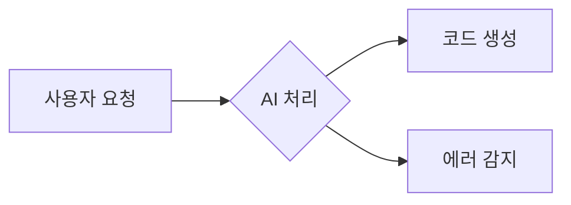
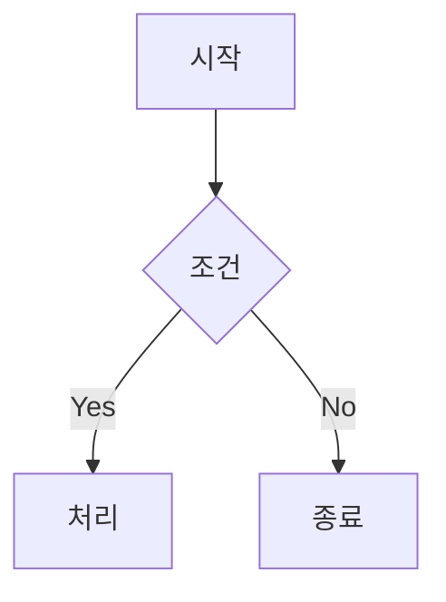
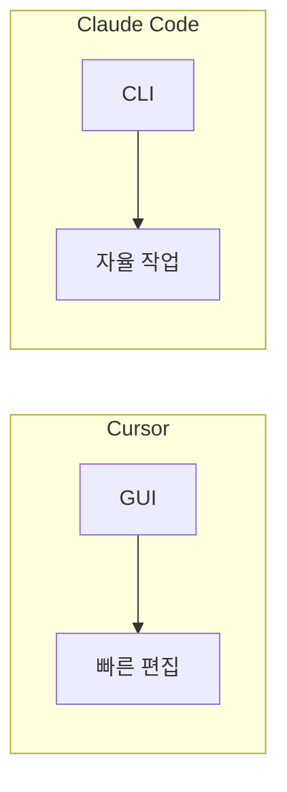
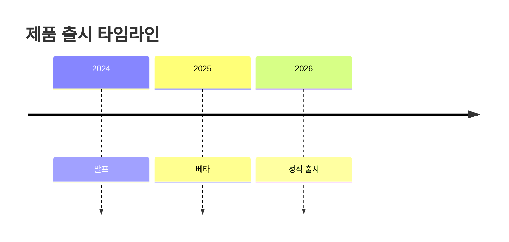

# 블로그 포스트 개선 워크플로우

## 개요

모든 블로그 포스트에 적용하는 표준화된 개선 프로세스입니다.

## 개선 요소

### 1. 이미지 삽입

#### 이미지 유형
| 유형 | 용도 | 예시 |
|------|------|------|
| **제품/서비스 이미지** | 공식 발표, 스크린샷 | Cursor IDE, Apple Intelligence |
| **뉴스 이미지** | 트렌드, 이벤트 | GTA6 트레일러, 테슬라 발표 |
| **인포그래픽** | 데이터 시각화 | 시장 점유율, 가격 비교 |
| **밈** | 재미, 공감대 | 적절한 위치에 1-2개 |

#### 이미지 소싱 우선순위
1. **공식 소스**: 회사 뉴스룸, 프레스킷
2. **신뢰 매체**: TechCrunch, The Verge, 한경 등
3. **무료 스톡**: Unsplash, Pexels (일반 이미지)
4. **밈 사이트**: Know Your Meme, imgflip (밈)

#### 마크다운 형식
```markdown

*출처: [매체명](원본 URL)*
```

#### 예시
```markdown

*출처: [Cursor 공식 블로그](https://cursor.com/blog)*

---


*"버그 하나 잡으려다 3개 만들었을 때"*
```

### 2. 다이어그램 (Mermaid.js)

#### 사용 시점
- ASCII 아트로 된 플로우차트 대체
- 비교표가 복잡할 때 시각화
- 시스템 아키텍처 설명

#### 마크다운 형식
````markdown

````

#### 다이어그램 유형별 예시

**플로우차트**:


**비교 다이어그램**:


**타임라인**:


### 3. 밈 가이드라인

#### 밈 삽입 원칙
- 포스트당 **1-3개** 적정
- 콘텐츠와 **관련 있는** 밈만
- **중간 또는 끝**에 배치 (도입부 X)
- 저작권 걱정 없는 유명 템플릿 사용

#### 추천 밈 카테고리
| 주제 | 추천 밈 |
|------|---------|
| 개발/코딩 | "This is fine" 개, Drake 비교, Distracted Boyfriend |
| AI/기술 | Galaxy Brain, Expanding Brain, Surprised Pikachu |
| 투자/돈 | Stonks, Money Printer Go Brrr |
| 게임 | Press F to Pay Respects, Git Gud |
| 일반 | Pepe, Doge, Wojak |

#### 밈 검색 사이트
- https://knowyourmeme.com - 밈 백과사전
- https://imgflip.com/memegenerator - 밈 생성기
- https://tenor.com - GIF 검색

### 4. 코드 블록 vs 다이어그램 판단 기준

| 상황 | 사용 도구 |
|------|----------|
| 실제 실행 가능한 코드 | 코드 블록 |
| 단순 목록/비교 | 코드 블록 (ASCII) |
| 프로세스 흐름 | Mermaid 플로우차트 |
| 시스템 구조 | Mermaid 다이어그램 |
| 타임라인 | Mermaid 타임라인 |

## 포스트별 개선 체크리스트

```
□ 대표 이미지 1개 (도입부 근처)
□ 관련 이미지 2-3개 (본문 중간)
□ 밈 1-2개 (적절한 위치)
□ ASCII 다이어그램 → Mermaid 변환
□ 이미지 출처 캡션 추가
□ 외부 링크 동작 확인
```

## 이미지 검색 프롬프트 가이드

### 제품 이미지
```
site:techcrunch.com OR site:theverge.com "[제품명]" press image
site:[공식사이트] newsroom "[제품명]"
```

### 밈 검색
```
site:knowyourmeme.com "[주제] meme"
site:imgflip.com "[감정/상황] meme"
```

## 배치 처리 명령

### 전체 포스트 목록 확인
```bash
ls -1 astro-blog/src/data/blog/*.md | wc -l
```

### 개선 진행률 추적
- `.claude/workflows/enhancement-progress.json`에 상태 저장
- 포스트별 완료 여부 체크
