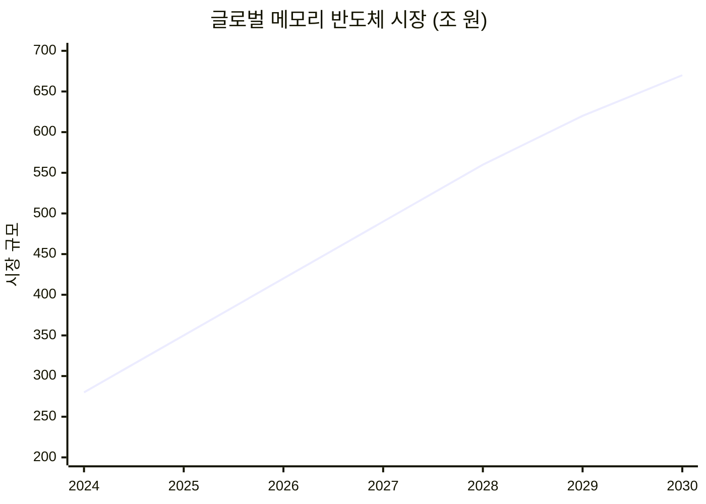
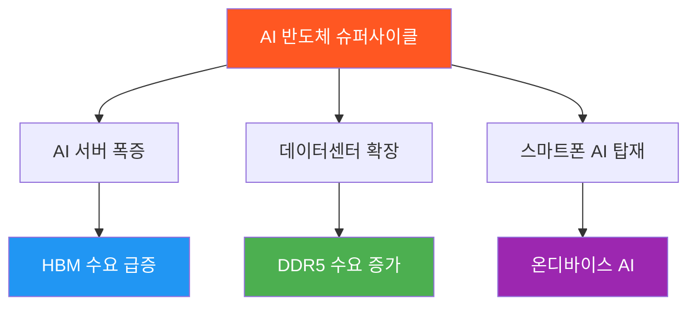
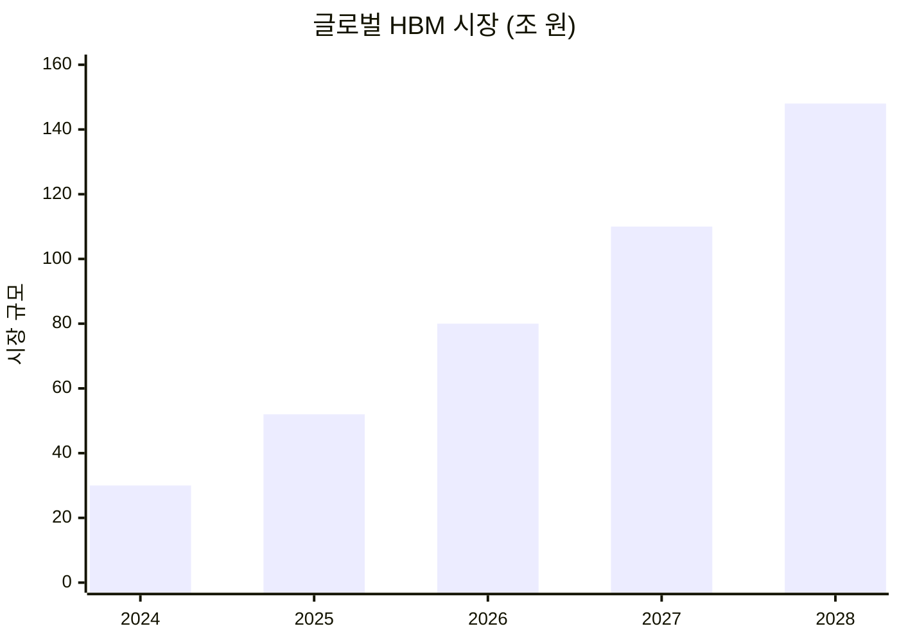
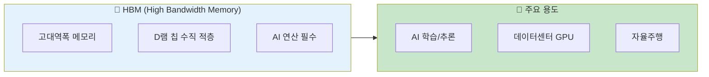
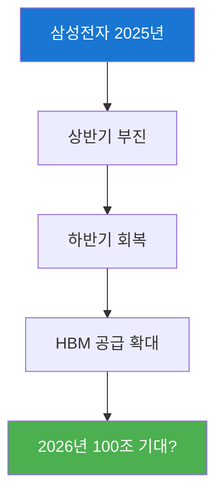
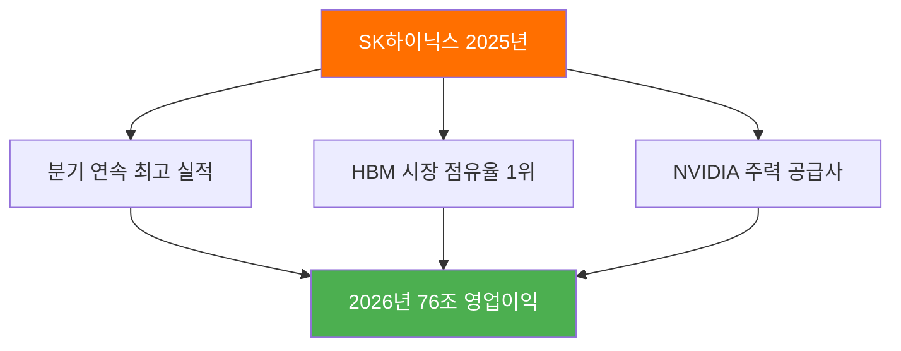
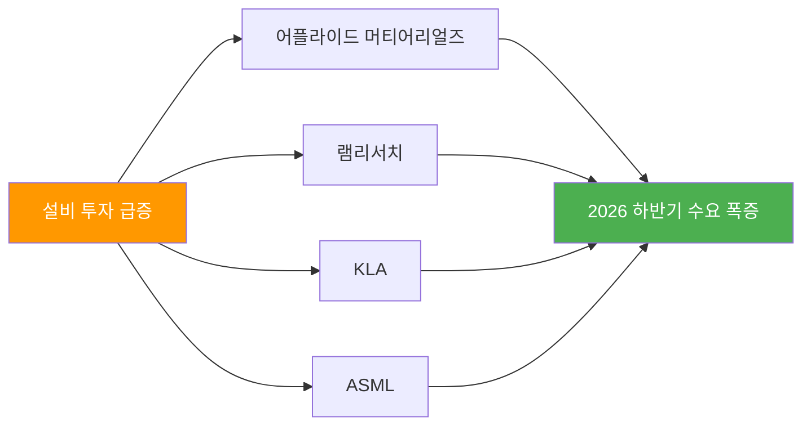
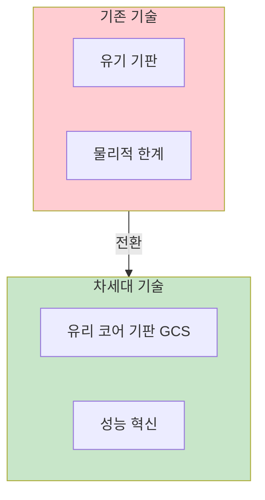
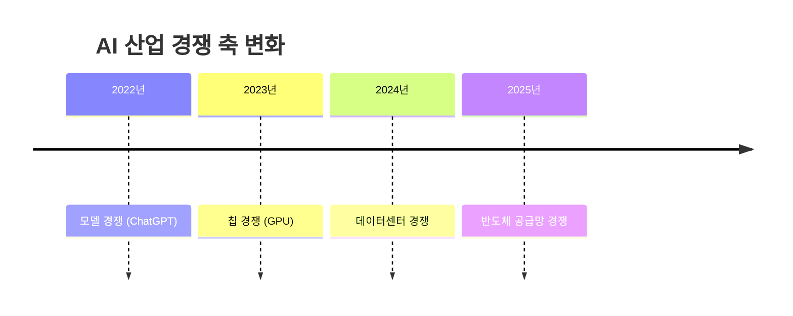
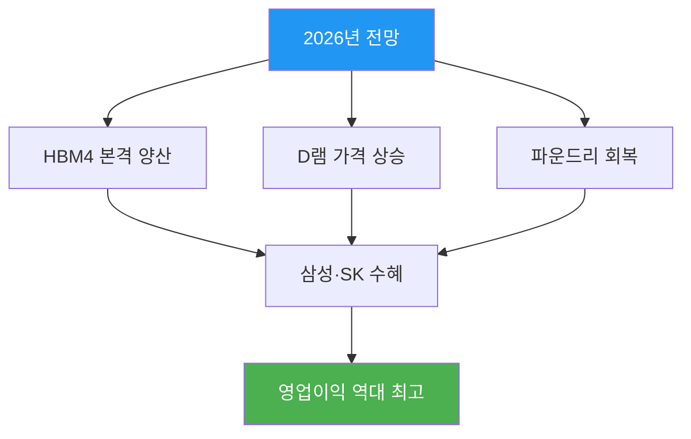

*AI 반도체가 바꾸는 미래*

## 슈퍼사이클이 온다

> "2030년 670조 원 규모의 메모리 반도체 슈퍼사이클"
> — 글로벌 시장 전망

AI와 데이터센터 수요 폭발로 메모리 반도체 시장이 전례 없는 성장기에 진입하고 있습니다. 삼성전자와 SK하이닉스가 이 거대한 물결을 주도합니다.

---

## 1. 2030년 메모리 시장 전망

### 시장 규모 성장



| 연도 | 시장 규모 | 특징 |
|------|----------|------|
| 2024년 | 약 280조 원 | 회복 시작 |
| 2025년 | 약 350조 원 | 본격 성장 |
| 2030년 | **670조 원** | 슈퍼사이클 정점 |

### 성장 동력



---

## 2. HBM 시장: 삼성·SK 90% 장악

### HBM 시장 규모 전망



| 연도 | 시장 규모 | 연평균 성장률 |
|------|----------|--------------|
| 2025년 | 51.7조 원 | - |
| 2028년 | **147.8조 원** | 약 40% |

### HBM이란?



### HBM 세대별 비교

| 세대 | 대역폭 | 용량 | 양산 시점 |
|------|--------|------|----------|
| HBM2e | 460GB/s | 16GB | 2020년~ |
| HBM3 | 819GB/s | 24GB | 2022년~ |
| HBM3E | 1.15TB/s | 36GB | 2024년~ |
| **HBM4** | **1.5TB/s+** | **48GB+** | **2026년~** |

---

## 3. 삼성전자 vs SK하이닉스

### 2025년 실적 비교

| 항목 | 삼성전자 | SK하이닉스 |
|------|----------|-----------|
| **영업이익 전망** | 85조 원 | 76조 원 |
| **전망 상향폭** | +94% (3개월) | +66% (3개월) |
| **HBM 강점** | 12단 HBM3E | 시장 1위 점유율 |
| **핵심 고객** | NVIDIA 공급 확대 | NVIDIA 주요 공급사 |

### 삼성전자 회복세



### SK하이닉스 독주



---

## 4. 2026년 설비 투자 폭증

### 주요 팹 가동 일정

| 프로젝트 | 기업 | 가동 시점 |
|----------|------|----------|
| 테일러 2nm | 삼성전자 | 2026~27년 |
| 용인 클러스터 | SK하이닉스 | 2026~27년 |
| 2~3nm 확장 | TSMC | 2026년 |

### 장비 투자 현황



---

## 5. 유리 기판(GCS) 경쟁

### 차세대 패키징 기술



### GCS 경쟁 현황

| 기업 | 목표 | 의미 |
|------|------|------|
| **삼성전기** | 2027년 양산 | 세계 첫 상용화 경쟁 |
| **SKC** | 2027년 양산 | 세계 첫 상용화 경쟁 |
| **인텔** | 2025년 시범 | 기술 선도 |

### GCS의 장점

| 항목 | 유기 기판 | 유리 기판 |
|------|----------|----------|
| 열팽창 | 높음 | **낮음** |
| 미세배선 | 한계 | **극미세 가능** |
| 두께 | 두꺼움 | **얇음** |
| AI 적합성 | 보통 | **우수** |

---

## 6. AI 산업 패러다임 변화

### 2025년 AI 경쟁 무게중심 이동



### 핵심 변화

| 과거 | 현재 |
|------|------|
| AI 모델 알고리즘 | 하드웨어 인프라 |
| 소프트웨어 혁신 | 반도체 공급 |
| OpenAI vs Google | **NVIDIA + 삼성 + SK** |

> "AI 한계 성능을 결정짓는 요소가 알고리즘에서 하드웨어로 이동"

---

## 7. 주요 기업 투자 포인트

### 삼성전자 (005930)

| 항목 | 내용 |
|------|------|
| **2026년 영업이익** | 85~100조 원 예상 |
| **핵심 사업** | HBM, 파운드리, 메모리 |
| **주요 과제** | HBM 점유율 확대 |
| **투자 포인트** | 가치 회복 기대 |

### SK하이닉스 (000660)

| 항목 | 내용 |
|------|------|
| **2026년 영업이익** | 76조 원 예상 |
| **핵심 사업** | HBM 시장 1위 |
| **주요 고객** | NVIDIA 핵심 공급사 |
| **투자 포인트** | AI 수혜 지속 |

### 관련주

| 기업 | 분야 | 특징 |
|------|------|------|
| 삼성전기 | 패키지 | GCS 개발 |
| SKC | 소재 | GCS 개발 |
| 한미반도체 | 장비 | HBM 본딩 |
| ISC | 소재 | 테스트 소켓 |

---

## 8. 2026년 전망

### 반도체 업황 전망



### 핵심 일정

```
📅 2026년 반도체 주요 일정

【HBM】
☐ HBM4 양산 시작 (SK하이닉스)
☐ HBM4 양산 (삼성전자)
☐ NVIDIA Blackwell Ultra 출시

【파운드리】
☐ 삼성 테일러 2nm 가동
☐ TSMC 2nm 확장

【패키징】
☐ GCS 양산 준비 (삼성전기, SKC)
☐ 첨단 패키징 수요 폭증
```

---

## 9. 투자 체크리스트

### 반도체 투자 시 고려사항

```
✅ K-반도체 투자 체크리스트

【기본 분석】
☐ HBM 시장 점유율 확인
☐ 주요 고객사 (NVIDIA 등)
☐ 기술 로드맵 (HBM4, GCS)
☐ 설비 투자 계획

【리스크 요인】
☐ 미중 반도체 갈등
☐ 수요 둔화 가능성
☐ 경쟁사 기술 추격
☐ 환율 변동

【성장 동력】
☐ AI 서버 수요 지속
☐ 온디바이스 AI 확산
☐ 자율주행 시장 성장
☐ 데이터센터 확장
```

---

## 10. 결론: K-반도체의 황금기

### 2025년 핵심 성과

| # | 성과 |
|---|------|
| 1 | 삼성·SK 2025년 실적 대폭 개선 |
| 2 | HBM 시장 90% 점유 전망 |
| 3 | 2030년 670조 슈퍼사이클 진입 |
| 4 | 유리기판 세계 첫 상용화 경쟁 |
| 5 | AI 반도체 공급망 핵심 위치 |

### K-반도체 미래

```
2020년: HBM2e 시대
2024년: HBM3E 시대
2026년: HBM4 시대 개막
2030년: 670조 슈퍼사이클

"AI가 클수록, K-반도체가 빛난다"
```


*AI 시대의 핵심, K-반도체*

---

**반도체 투자에 대해 궁금한 점이 있으신가요?** 댓글로 남겨주세요!

---

## 참고 자료

- [글로벌이코노믹 - 2030년 670조 메모리 슈퍼사이클](https://www.g-enews.com/article/Global-Biz/2025/12/202512060807424679fbbec65dfb_1)
- [네이트 뉴스 - 삼성·SK HBM4 시장 90%](https://news.nate.com/view/20251219n14022)
- [CEOSCOREDAILY - 삼성·SK AI 반도체 슈퍼사이클](https://m.ceoscoredaily.com/page/view/2025120814104920681)
- [글로벌이코노믹 - 삼성전기·SKC 유리기판 2027년 양산](https://www.g-enews.com/article/Global-Biz/2025/12/202512260704358314fbbec65dfb_1)
- [대한경제 - 2025 업종 결산 반도체·AI](https://www.dnews.co.kr/uhtml/view.jsp?idxno=202512201706016580572)
