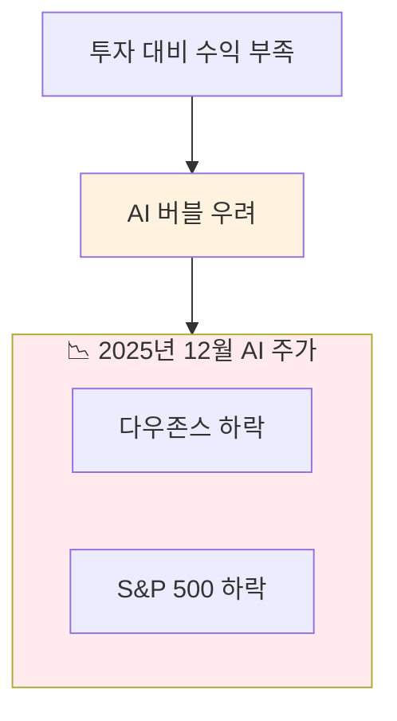

import StatCard from "@/components/widgets/StatCard.astro";
import ComparisonTable from "@/components/widgets/ComparisonTable.astro";
import HighlightBox from "@/components/widgets/HighlightBox.astro";
import QuoteBox from "@/components/widgets/QuoteBox.astro";
import TimelineItem from "@/components/widgets/TimelineItem.astro";


*2025년, AI 업계는 격동의 한 해를 보냈습니다*

## 2025년 AI 업계, 한 줄 요약

<QuoteBox author="모든 AI 투자자들의 심정">
기대는 컸고, 현실은 복잡했다
</QuoteBox>

2025년 12월, AI 업계는 혁신과 논쟁이 공존하는 한 해를 마무리하고 있습니다. 이 글에서는 올해 가장 중요했던 AI 뉴스들을 정리해봅니다.


*2025년 AI 뉴스를 따라가려는 사람들*

---

## 1. Google의 대역전극: 연초 꼴찌에서 연말 1위로

### Gemini 3의 등장

2025년은 Google의 해였습니다. 연초만 해도 "AI 경쟁에서 뒤처졌다"는 평가를 받던 Google이, **Gemini 3** 출시와 함께 완벽한 역전극을 펼쳤습니다.

<QuoteBox author="Marc Benioff, Salesforce CEO">
ChatGPT 버리고 Gemini 3으로 갈아탑니다
</QuoteBox>

*출처: [Yahoo Finance - Google AI Race](https://finance.yahoo.com/news/google-started-the-year-behind-in-the-ai-race-it-ended-2025-on-top-150352574.html)*

### 숫자로 보는 Gemini의 성장

<StatCard
  value="+30%"
  label="Gemini MAU 성장률 (8월~12월)"
  trend="up"
  description="Nano Banana AI 앱 바이럴로 급성장"
/>

### Gemini 3 Flash 출시

12월에는 **Gemini 3 Flash**까지 출시되며 마무리를 장식했습니다.

<ComparisonTable
  headers={["모델", "특징", "강점"]}
  rows={[
    ["Gemini 3 Pro", "최고 성능", "복잡한 추론"],
    ["Gemini 3 Flash", "Pro급 품질 + 빠른 속도", "가성비 최강"]
  ]}
/>

*출처: [Google Blog - AI Recap 2025](https://blog.google/technology/ai/google-ai-news-recap-2025/)*

---

## 2. AI 버블 논쟁: 거품인가 혁명인가?

### MIT Technology Review의 경고

2025년 12월, MIT Technology Review는 충격적인 분석을 발표했습니다.

<QuoteBox author="MIT Technology Review">
이것은 AI 과대광고 조정(hype correction)의 시작입니다. LLM이 AGI로 가는 문이 아니라는 게 명백해졌습니다.
</QuoteBox>

*출처: [MIT Technology Review](https://www.technologyreview.com/2025/12/15/1129174/the-great-ai-hype-correction-of-2025/)*

### 주식 시장의 반응



### 하지만 반론도 있다

<ComparisonTable
  headers={["버블파 의견", "낙관파 의견"]}
  rows={[
    ["투자 대비 수익 부족", "장기 투자 관점 필요"],
    ["LLM의 한계 명확", "에이전트 AI가 게임체인저"],
    ["과대 포장된 기능들", "실제 생산성 향상 사례 많음"]
  ]}
/>

---

## 3. 디즈니 x OpenAI Sora: 역대급 빅딜

### 무슨 일이?

12월, 디즈니와 OpenAI가 역사적인 계약을 체결했습니다.

<HighlightBox title="디즈니 x Sora 딜 요약" variant="success">
**계약 내용:**
Sora 사용자가 디즈니 캐릭터 200+개를 활용해 AI 영상을 생성할 수 있게 됨!

**포함 프랜차이즈:**
- 마블 (아이언맨, 스파이더맨...)
- 스타워즈 (다스베이더...)
- 픽사 (우디, 버즈...)
- 디즈니 클래식 (미키마우스...)
</HighlightBox>

*출처: [AI Apps Blog](https://www.aiapps.com/blog/ai-news-december-2025-breakthroughs-launches-trends/)*

### 왜 중요한가?

<ComparisonTable
  headers={["의미", "설명"]}
  rows={[
    ["저작권의 새 시대", "대형 IP가 AI 생성에 공식 허용"],
    ["수익 모델", "IP 라이선스 + AI의 첫 사례"],
    ["창작 민주화", "누구나 디즈니급 영상 제작 가능"]
  ]}
/>

### 예상되는 콘텐츠

```
유저: "스파이더맨이 한강에서 라면 먹는 영상 만들어줘"
Sora: *생성 중...*
유저: "와 이게 된다고?"
```


*디즈니 x Sora 소식을 들은 크리에이터들*

---

## 4. 2025년 AI 14대 키워드 (MIT 선정)

MIT Technology Review가 선정한 **2025년 피할 수 없었던 AI 용어 14개**를 정리했습니다.

*출처: [MIT Technology Review - AI Wrapped 2025](https://www.technologyreview.com/2025/12/25/1130298/ai-wrapped-the-14-ai-terms-you-couldnt-avoid-in-2025/)*

### TOP 5 키워드

<ComparisonTable
  headers={["순위", "키워드", "설명"]}
  rows={[
    ["1", "AI Agents", "자율적으로 작업 수행하는 AI"],
    ["2", "Vibe Coding", "자연어로 코딩하는 새 패러다임"],
    ["3", "Agentic AI", "에이전트 기반 AI 시스템"],
    ["4", "MCP", "AI 도구 연결 표준 프로토콜"],
    ["5", "Hype Correction", "AI 과대광고 조정"]
  ]}
/>

### Vibe Coding 상세

<QuoteBox author="Andrej Karpathy, OpenAI 공동창업자 (용어 창시자)">
코딩 지식 제로인 사람들도 생성형 AI 코딩 어시스턴트에 프롬프트만 넣어서 앱과 웹사이트를 만들 수 있게 됐다
</QuoteBox>

---

## 5. 12월 주요 모델 출시 타임라인

### 12월 11일: 빅뱅 데이

2025년 12월 11일은 AI 역사에 기록될 날입니다. Google과 OpenAI가 **같은 날** 차세대 모델을 출시했습니다.

<HighlightBox title="2025년 12월 11일" variant="warning">
**10:00 AM** — Google: "Gemini 3 Pro 출시합니다!"

**11:00 AM** — OpenAI: "GPT-5.2 출시합니다!"

**12:00 PM** — 인터넷: "뭘 먼저 테스트하지...?"
</HighlightBox>

### 12월 모델 스펙 비교

<ComparisonTable
  headers={["모델", "출시일", "핵심 개선점"]}
  rows={[
    ["Gemini 3 Pro", "12.11", "Deep Research, 팩트 정확도 1위"],
    ["GPT-5.2", "12.11", "256k 토큰, 멀티스텝 추론 강화"],
    ["Claude Opus 4.5", "11.24", "코딩 벤치마크 1위, 5.5시간 자율"],
    ["Gemini 3 Flash", "12월", "Pro급 품질 + Flash급 속도"]
  ]}
/>

*출처: [Crescendo AI News](https://www.crescendo.ai/news/latest-ai-news-and-updates)*

---

## 6. 한국 AI 트렌드 2025

### NIA 12대 디지털 트렌드

한국지능정보사회진흥원(NIA)이 발표한 2025년 12대 트렌드:

<HighlightBox title="NIA 2025년 12대 디지털 트렌드" variant="info">
1️⃣ AI 어시스턴트 → 에이전트 진화
2️⃣ AI 거버넌스 시작
3️⃣ AI 반도체 패권 경쟁
4️⃣ 범용 AI 로봇
5️⃣ AI 자율주행 모빌리티
6️⃣ 감정 노동 AI 대체
7️⃣ AI + 디지털 트윈 제조 혁신
8️⃣ 디지털 창작 르네상스
9️⃣ AI 보안의 양면성
🔟 포스트 5G 서비스
1️⃣1️⃣ 엣지 컴퓨팅 + 온디바이스 AI
1️⃣2️⃣ 딥페이크 대응
</HighlightBox>

*출처: [NIA 한국지능정보사회진흥원](https://www.nia.or.kr/site/nia_kor/ex/bbs/View.do?cbIdx=25932&bcIdx=27606)*

### SK텔레콤 7대 IT 트렌드

<ComparisonTable
  headers={["트렌드", "설명"]}
  rows={[
    ["AI 인프라", "최적화된 클라우드로 AI 지원"],
    ["AI 에이전트", "개인화된 자율 AI"],
    ["인간-로봇 상호작용", "기술 개발 가속화"],
    ["양자내성암호화", "실제 적용 단계"]
  ]}
/>

*출처: [SK텔레콤 뉴스룸](https://news.sktelecom.com/209135)*

---

## 7. 바이럴: Nano Banana AI 앱

### 8월의 깜짝 히트작

Google의 **Nano Banana AI** 이미지 앱이 8월에 바이럴을 탔습니다.

<HighlightBox title="Nano Banana AI" variant="success">
**기능:** 사진을 귀여운 바나나 캐릭터로 변환

**결과:** Gemini MAU 30% 성장에 기여

**"왜 바나나냐고요? 저희도 몰라요"**
— Google 마케팅팀 (아마도)
</HighlightBox>

### 왜 바이럴?

<ComparisonTable
  headers={["요소", "설명"]}
  rows={[
    ["단순함", "클릭 한 번이면 끝"],
    ["재미", "누구나 바나나가 될 수 있음"],
    ["공유성", "SNS에 올리기 딱 좋음"]
  ]}
/>

---

## 8. 2025년 AI 밈 베스트

### "AI가 나 대신 일하게 해줘" 밈

```
2024년: "AI가 내 일을 빼앗을까봐 걱정"
2025년: "AI야 제발 내 일 좀 해줘"
```

### "에이전트 맞아?" 밈

```
회사: "우리 AI는 에이전트입니다"
사용자: "이거 그냥 챗봇 아니야?"
회사: "아니요, 에이전틱 AI입니다"
사용자: "뭔 차이야"
회사: "마케팅팀에 물어보세요"
```

### "버블 터질 거야" 밈

```
2023년: "AI 버블 터진다"
2024년: "진짜 터진다"
2025년: "이번엔 진짜..."
주가: 📈📉📈📉📈
```


---

## 결론: 2025년이 남긴 것

### 핵심 인사이트

<ComparisonTable
  headers={["#", "인사이트"]}
  rows={[
    ["1", "Google이 연말 AI 리더로 등극"],
    ["2", "AI 버블 논쟁은 계속 중"],
    ["3", "디즈니-Sora 딜로 IP+AI 시대 개막"],
    ["4", "에이전트 AI가 2026년 핵심"],
    ["5", "바이브 코딩이 개발 문화 변화 중"]
  ]}
/>

### 2026년 예측

<HighlightBox title="2026년 AI 전망" variant="info">
- 에이전트 AI 상용화 본격화
- AI 규제 강화 (EU AI Act 시행)
- 온디바이스 AI 확산
- AI IP 라이선스 비즈니스 성장
- 더 많은 "버블 터진다" 기사 (아마도)
</HighlightBox>

<QuoteBox author="AI 업계 분석가들의 공통 의견">
2025년은 AI가 과대광고에서 현실로 내려오기 시작한 해입니다. 2026년은 진짜 가치가 증명되는 해가 될 것입니다.
</QuoteBox>

---

**2025년 가장 인상적이었던 AI 뉴스는 무엇인가요?** 댓글로 공유해주세요!

---

## 참고 자료

- [MIT Technology Review - AI Hype Correction 2025](https://www.technologyreview.com/2025/12/15/1129174/the-great-ai-hype-correction-of-2025/)
- [MIT Technology Review - AI Wrapped 2025](https://www.technologyreview.com/2025/12/25/1130298/ai-wrapped-the-14-ai-terms-you-couldnt-avoid-in-2025/)
- [Google Blog - 2025 Research Breakthroughs](https://blog.google/technology/ai/2025-research-breakthroughs/)
- [Yahoo Finance - Google AI Race](https://finance.yahoo.com/news/google-started-the-year-behind-in-the-ai-race-it-ended-2025-on-top-150352574.html)
- [AI Apps - December 2025 News](https://www.aiapps.com/blog/ai-news-december-2025-breakthroughs-launches-trends/)
- [Crescendo AI - Latest News](https://www.crescendo.ai/news/latest-ai-news-and-updates)
- [NIA 2025 디지털 트렌드](https://www.nia.or.kr/site/nia_kor/ex/bbs/View.do?cbIdx=25932&bcIdx=27606)
- [SK텔레콤 7대 IT 트렌드](https://news.sktelecom.com/209135)
