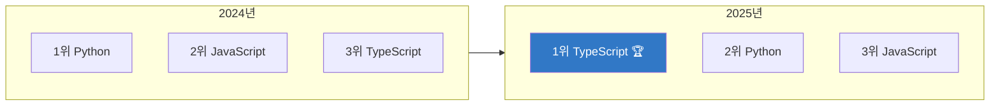

*2025년, 개발자 생태계가 완전히 바뀌었습니다*

## 2025년 개발 생태계, 한눈에 보기

2025년은 개발자에게 격변의 해였습니다. TypeScript가 GitHub 1위 언어로 등극하고, AI 코딩 도구가 일상이 되었습니다.

> "2025년, 개발자는 더 이상 혼자 코딩하지 않는다"
> — Stack Overflow Developer Survey 2025


*AI와 함께 코딩하는 게 일상이 된 2025년*

---

## 1. TypeScript: GitHub 1위 언어 등극

### 역사적인 순간

2025년, **TypeScript가 Python과 JavaScript를 제치고 GitHub 1위 언어**가 되었습니다.



> "타입 안전성이 대세가 되다"

*출처: [Grey Matter - Developer Tool Trends 2025](https://greymatter.com/content-hub/2025-top-developer-tool-trends-mid-year-review/)*

### 왜 TypeScript가 1위가 되었나?

| 요인 | 설명 |
|------|------|
| **AI 코딩 호환성** | 타입 정보로 AI가 더 정확한 코드 생성 |
| **대규모 프로젝트** | 팀 협업에서 타입 시스템 필수 |
| **생태계 성숙** | 거의 모든 라이브러리가 TS 지원 |
| **IDE 지원** | VS Code + TS = 최강 조합 |

> "AI 어시스턴트 시대에 타입이 있는 언어가 더 잘 작동합니다. TypeScript의 상승은 필연이었습니다."
> — [Vornext Developer Tools News](https://vornext.com/developer-tools-news/)

---

## 2. Rust의 꾸준한 상승세

### 시스템 프로그래밍의 새 표준

**Rust**가 2025년에도 가장 주목받는 시스템 프로그래밍 언어로 자리매김했습니다.

```
🦀 Rust 채택 기업들

├─ Microsoft (Windows 커널 일부)
├─ Google (Android, Chrome)
├─ Amazon (AWS 인프라)
├─ Meta (인프라)
└─ Cloudflare (엣지 컴퓨팅)
```

*출처: [코드트리 - 2025 웹 개발 트렌드](https://www.codetree.ai/blog/2025-웹-개발-트렌드-2탄-프로그래밍-언어-개발자-로드맵/)*

### 왜 Rust인가?

| 장점 | 설명 |
|------|------|
| **메모리 안전성** | 컴파일 타임에 버그 방지 |
| **성능** | C/C++ 수준의 성능 |
| **현대적 문법** | 개발자 경험 좋음 |
| **보안** | 메모리 취약점 원천 차단 |

---

## 3. 숫자로 보는 GitHub 2025

### 역대급 성장

2025년 GitHub은 사상 최대 규모를 기록했습니다.

```
📈 GitHub 2025년 통계

👥 개발자 수: 1억 8천만 명+
   (1초마다 1명씩 가입)

📁 저장소 수: 6억 3천만+
   (올해만 1.21억 개 추가)

💻 커밋 수: 9.86억 회
   (전년 대비 +25%)

🔀 Pull Request: 전년 대비 +20.4%

🐛 Issues: 전년 대비 +11.3%

🤝 총 기여: 11.2억 건
```

*출처: [DEV Community - Developer Tools 2025](https://dev.to/platypus98/9-development-tools-every-developer-should-watch-in-2025-199)*

### 신규 개발자의 AI 도구 사용률

```
🆕 GitHub 신규 가입자 중 AI 도구 사용

첫 주 내 Copilot 사용률: 80%

"AI 없이 코딩하는 걸 상상할 수 없어요"
— 2025년 신규 개발자들
```

---

## 4. AI 코딩 도구 대중화

### Stack Overflow 조사 결과

> "개발자의 65%가 매주 AI 코딩 도구를 사용합니다"
> — Stack Overflow Developer Survey 2025

*출처: [Aviator - Top Developer Tooling 2025](https://www.aviator.co/blog/top-10-developer-tooling-for-2025/)*

### 주요 AI 코딩 도구

| 도구 | 특징 | 채택률 |
|------|------|--------|
| **GitHub Copilot** | 원조 AI 코딩 | 80%+ 팀 채택 |
| **Cursor** | VSCode 기반 AI IDE | 급성장 |
| **Cody AI** | 코드 품질 중심 | 인기 상승 |
| **JetBrains Junie** | JetBrains 생태계 | 신규 출시 |
| **Google Jules** | 비동기 코딩 에이전트 | 베타 |


*AI가 코드 작성을 도와주는 2025년*

### 2025년 주요 업데이트

```
🔄 2025년 AI 코딩 도구 업데이트

8월: VS 2022 v17.14 - GPT-5 모델 지원
     → 코드 제안 품질 대폭 향상

12월: Chrome DevTools - Gemini AI 통합
     → 콘솔에서 AI 코드 제안

전체: GitHub Copilot - GPT-5.2 업그레이드
     → 더 긴 컨텍스트, 더 정확한 제안
```

*출처: [Vornext Developer Tools News](https://vornext.com/developer-tools-news-2/)*

---

## 5. 프로그래밍 언어 순위 2025

### IEEE Spectrum 조사 결과

```
🏆 2025년 프로그래밍 언어 순위 (IEEE)

1위: Python     🐍 (AI/ML의 왕)
2위: Java       ☕ (여전한 엔터프라이즈)
3위: C++        ⚡ (성능 크리티컬)
4위: SQL        📊 (데이터는 영원)
5위: C#         🎮 (게임 + 엔터프라이즈)
6위: JavaScript 🌐 (웹의 기본)
7위: TypeScript 📘 (급상승!)
8위: C          💻 (임베디드 필수)
9위: Shell      🐚 (자동화)
10위: Go        🔧 (클라우드 인프라)
```

*출처: [GeekNews - 2025년 인기 언어](https://news.hada.io/topic?id=23330)*

### 주목할 변화

| 언어 | 변화 | 이유 |
|------|------|------|
| JavaScript | 3위→6위 하락 | TypeScript로 이동 |
| TypeScript | 급상승 | AI 코딩 호환성 |
| Rust | 꾸준한 상승 | 보안 중시 트렌드 |
| Go | 안정적 | 클라우드 필수 |
| Kotlin | 성장 | 멀티플랫폼 지원 |

---

## 6. 개발자 채용 시장

### 2025년 채용 시장 현실

```
💼 2025년 채용 시장 변화

채용 규모: 📉 감소
채용 기준: 📈 상승

"얼마나 많이 뽑느냐" → "누구를 뽑느냐"
```

*출처: [코드트리 - 개발자 채용 트렌드](https://www.codetree.ai/blog/2025년-개발자-채용-트렌드와-2026년-전망-ai-시대-취업-준비/)*

### 수요가 높은 직군 (Statista)

| 순위 | 직군 | 비고 |
|------|------|------|
| 1 | 풀스택/백엔드 개발자 | 여전히 최고 수요 |
| 2 | AI/ML 전문가 | 급증 |
| 3 | 프론트엔드 엔지니어 | 안정적 |
| 4 | DevOps 전문가 | 필수 역량화 |
| 5 | 보안 엔지니어 | 중요도 상승 |

### 아이러니한 상황

```
┌────────────────────────────────────────────────┐
│          🤔 2025년 개발자 시장 역설             │
├────────────────────────────────────────────────┤
│                                                │
│  AI가 쉬운 코딩 다 해줌                         │
│              ↓                                 │
│  주니어 일자리 감소                             │
│              ↓                                 │
│  시니어 기준 상승                               │
│              ↓                                 │
│  "AI 잘 쓰는 개발자" 수요 증가                  │
│                                                │
└────────────────────────────────────────────────┘
```

---

## 7. 2025년 핵심 기술 트렌드

### ITWorld 선정: 뜨는 기술 vs 지는 기술

**뜨는 기술:**
- AI 에이전트
- 온디바이스 AI
- WebAssembly (Wasm)
- 서버리스 아키텍처
- 로우코드/노코드

**지는 기술:**
- 전통적 모놀리식 아키텍처
- 수동 배포
- 단순 자동완성
- 레거시 CMS

*출처: [ITWorld - 2025년 뜨는/지는 기술](https://www.itworld.co.kr/article/3630575/2025년-뜨는-기술-10가지-지는-기술-10가지.html)*

### 웹 개발 트렌드 (인포그랩)

| 트렌드 | 설명 |
|--------|------|
| **AI 개발 도구** | 코딩 넘어 전체 개발 프로세스 |
| **WebAssembly** | 브라우저에서 네이티브급 성능 |
| **JAMstack** | 정적 사이트 + API |
| **Utility-First CSS** | Tailwind 대세 지속 |
| **서버리스** | 인프라 관리 불필요 |

*출처: [인포그랩 - 2025 웹 개발 트렌드](https://insight.infograb.net/blog/2025/02/05/2025-devtrends/)*

---

## 8. 2026년 전망

### Gartner 예측

```
🔮 Gartner 2025-2026 전망

2025년: 신규 앱 70%가 로우코드/노코드 기반
2026년: 로우코드 사용자 80%가 비IT 인력

"개발자의 역할이 '코드 작성'에서
 '시스템 설계'로 이동 중"
```

### MIT Technology Review 분석

> "AI 코딩은 이제 어디에나 있습니다. 하지만 모두가 확신하는 것은 아닙니다."
> — [MIT Technology Review](https://www.technologyreview.com/2025/12/15/1128352/rise-of-ai-coding-developers-2026/)

---

## 결론: 개발자의 새로운 역할

### 핵심 인사이트

| # | 인사이트 |
|---|----------|
| 1 | TypeScript가 GitHub 1위 = 타입 안전성 대세 |
| 2 | AI 코딩 도구 65% 주간 사용 = 필수 스킬 |
| 3 | 채용 기준 상승 = 차별화 필요 |
| 4 | Rust 성장 = 시스템 보안 중시 |
| 5 | 로우코드 확산 = 개발자 역할 변화 |

### 2026년 준비 체크리스트

```
✅ 2026년을 위한 개발자 준비

☐ TypeScript 숙련도 높이기
☐ AI 코딩 도구 활용 능력
☐ 시스템 설계/아키텍처 역량
☐ 문제 해결 + 커뮤니케이션
☐ 특정 도메인 전문성
```

> "AI가 코드를 작성하는 시대, 개발자의 가치는 '어떤 코드를 작성할지 결정하는 것'에 있다"
> — 2025년 시니어 개발자들의 공통 조언


---

**여러분은 2025년 어떤 기술을 가장 많이 사용하셨나요?** 댓글로 공유해주세요!

---

## 참고 자료

- [코드트리 - 2025 웹 개발 트렌드](https://www.codetree.ai/blog/2025-웹-개발-트렌드-2탄-프로그래밍-언어-개발자-로드맵/)
- [인포그랩 - 2025 웹 개발 핵심 트렌드](https://insight.infograb.net/blog/2025/02/05/2025-devtrends/)
- [ITWorld - 2025년 뜨는/지는 기술](https://www.itworld.co.kr/article/3630575/2025년-뜨는-기술-10가지-지는-기술-10가지.html)
- [코드트리 - 개발자 채용 트렌드](https://www.codetree.ai/blog/2025년-개발자-채용-트렌드와-2026년-전망-ai-시대-취업-준비/)
- [Grey Matter - Developer Tool Trends 2025](https://greymatter.com/content-hub/2025-top-developer-tool-trends-mid-year-review/)
- [MIT Technology Review - AI Coding 2026](https://www.technologyreview.com/2025/12/15/1128352/rise-of-ai-coding-developers-2026/)
- [DEV Community - Developer Tools 2025](https://dev.to/platypus98/9-development-tools-every-developer-should-watch-in-2025-199)
- [Aviator - Top Developer Tooling 2025](https://www.aviator.co/blog/top-10-developer-tooling-for-2025/)
- [GeekNews - 2025년 인기 언어](https://news.hada.io/topic?id=23330)
