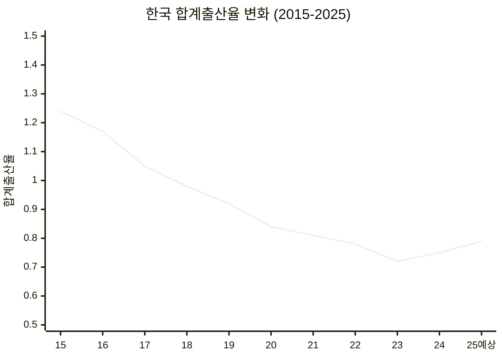
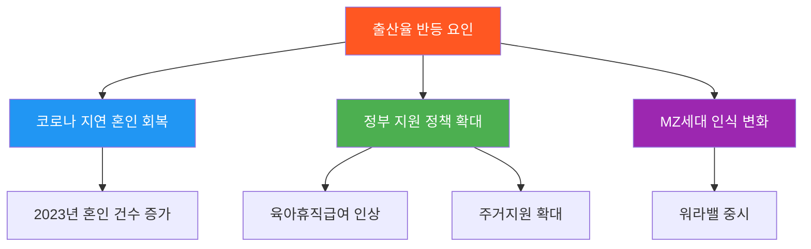
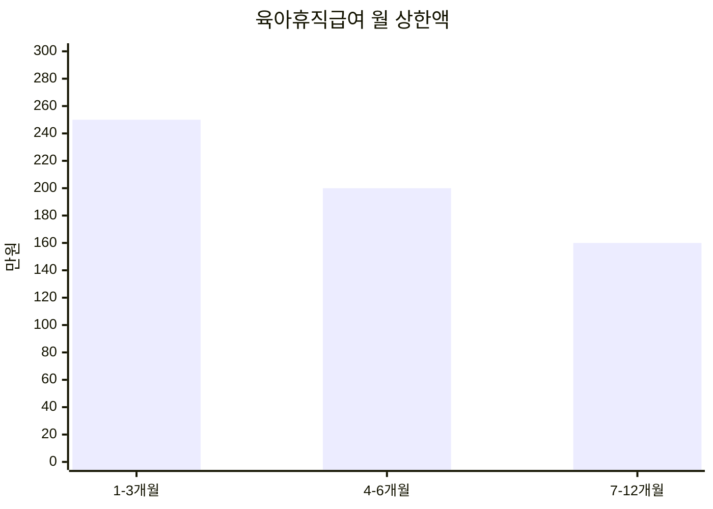
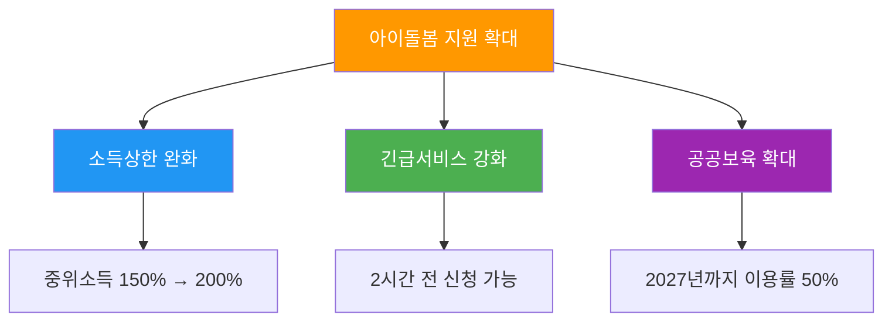
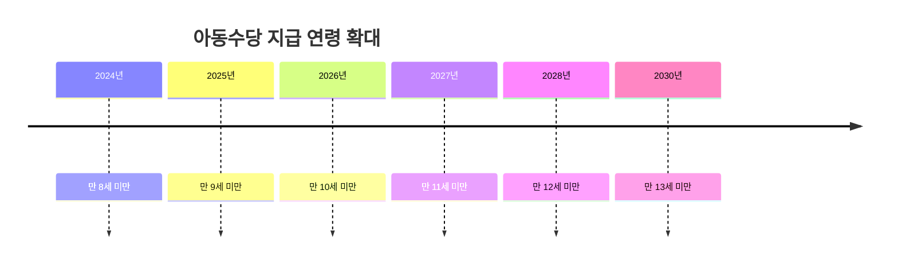
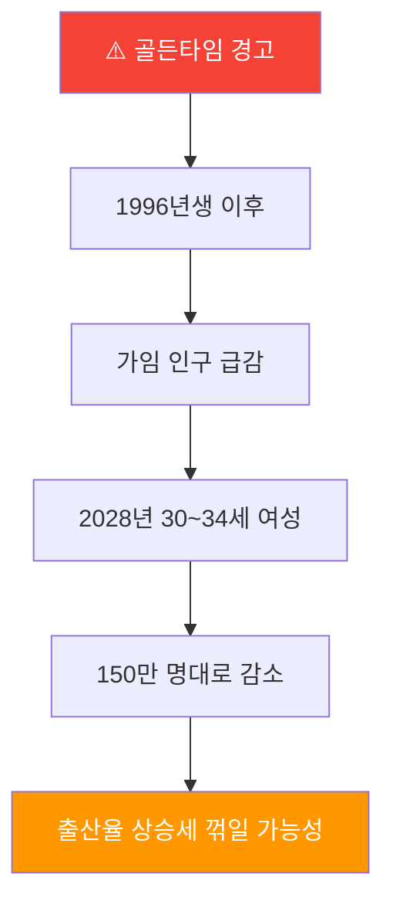

*2025년, 희망의 신호가 보입니다*

## 9년 만의 반등, 진짜일까?

> "출생아 수와 합계출산율이 동시에 오른 것은 2015년 이후 처음입니다"
> — 통계청 발표

2024년 대한민국의 합계출산율이 **0.75명**을 기록하며 9년 만에 반등했습니다. 출생아 수도 23만 명에서 **23만 8,300명**으로 증가했습니다.

---

## 1. 출산율 반등 현황

### 합계출산율 추이



### 핵심 수치

| 항목 | 2023년 | 2024년 | 변화 |
|------|--------|--------|------|
| **합계출산율** | 0.72명 | 0.75명 | +0.03 |
| **출생아 수** | 23만 명 | 23.8만 명 | +8,300명 |
| **조출생률** | 4.5명 | 4.6명 | +0.1 |

### 왜 반등했을까?



---

## 2. 2025년 전망

### 출산율 추가 상승 예상

| 지표 | 2024년 | 2025년 예상 |
|------|--------|------------|
| **합계출산율** | 0.75명 | 0.79명 |
| **출생아 수** | 23.8만 명 | 25만 명 |
| **월별 출생아** | 1.9만 명 | 2만 명+ |

> "2025년 2월 출생아가 2만 35명으로 11년 만에 2만 명을 넘어섰습니다"

### 2025년 2월 기록

- 출생아 수: **2만 35명** (전년 동월 대비 +3.2%)
- 합계출산율: **0.82명**
- 2개월 연속 0.8명 돌파

---

## 3. 2025년 육아휴직 지원

### 육아휴직급여 (2025년 1월~)



| 기간 | 지급률 | 월 상한액 |
|------|--------|----------|
| 1~3개월 | 통상임금 100% | **250만원** |
| 4~6개월 | 통상임금 100% | **200만원** |
| 7~12개월 | 통상임금 80% | **160만원** |

### 6+6 부모 함께 육아휴직


| 개월 | 월 상한액 |
|------|----------|
| 1개월 | 250만원 |
| 2개월 | 300만원 |
| 3개월 | 350만원 |
| 4개월 | 400만원 |
| 5개월 | 450만원 |
| 6개월 | 450만원 |

---

## 4. 기업 지원 확대

### 대체인력 지원금

| 항목 | 2024년 | 2025년 |
|------|--------|--------|
| **지원대상** | 출산휴가 | 출산휴가+육아휴직+근로시간단축 |
| **지원금** | 80만원 | **120만원** |

### 유연근무 장려금

| 항목 | 2024년 | 2025년 |
|------|--------|--------|
| **월 지원금** | 10~40만원 | **20~60만원** |

### 배우자 출산휴가

| 항목 | 현재 | 2025년 2월~ |
|------|------|------------|
| **급여 지급기간** | 5일 | **20일** |
| **대상** | 중소기업 | 중소기업 |

---

## 5. 아이돌봄 서비스

### 정부지원 확대



### 늘봄학교 전면 확대

| 연도 | 대상 |
|------|------|
| 2024년 | 초등 1학년 |
| 2025년 | 초등 1~2학년 |
| 2026년 | **전 학년** |

---

## 6. 주거 지원 정책

### 신생아 특례대출

| 항목 | 기존 | 2025년~ |
|------|------|---------|
| **소득요건** | 1.3억원 | **2.5억원** |
| **대상** | 2년 내 출산 | 2025~2027 출산 |
| **금리** | 연 1.6~3.3% | 연 1.6~3.3% |

### 주택공급 확대

| 항목 | 내용 |
|------|------|
| **출산가구 공급** | 연간 12만호 이상 |
| **신혼부부 특공** | 18% → **23%** (2025.2~) |

---

## 7. 아동수당 변화

### 지급 연령 확대



### 지역별 추가 지원

| 지역 | 월 지원액 |
|------|----------|
| 수도권 | 10만원 |
| 비수도권 | 10만원 + **5,000원** |
| 인구감소지역 | 10만원 + **1~2만원** |

---

## 8. 골든타임 경고

### 2028년이 마지노선



> "만 30~34세 여성 인구가 150만 명대로 줄어드는 2028년 직전까지가 골든타임"
> — 저출산고령사회위원회 부위원장

### 아시아 비교

| 국가 | 2025년 출생아 증감 |
|------|-------------------|
| 🇰🇷 한국 | **+6.4%** (유일한 증가) |
| 🇯🇵 일본 | 감소 |
| 🇨🇳 중국 | 감소 |
| 🇹🇼 대만 | 감소 |

---

## 9. 2025년 육아 지원 체크리스트

### 받을 수 있는 혜택

```
✅ 2025년 육아지원 체크리스트

【임신·출산】
☐ 임신·출산 진료비 지원 (100만원)
☐ 첫만남이용권 (200만원)
☐ 산후조리비 지원 (지자체별)

【육아휴직】
☐ 육아휴직급여 (월 최대 250만원)
☐ 6+6 부모 함께 육아휴직 (월 최대 450만원)
☐ 배우자 출산휴가 (20일)

【돌봄】
☐ 부모급여 (0세 월 100만원, 1세 월 50만원)
☐ 아이돌봄서비스 (소득 200% 이하)
☐ 늘봄학교 (초1~2)

【주거】
☐ 신생아 특례대출 (소득 2.5억 이하)
☐ 출산가구 주택공급 (연 12만호)
☐ 신혼부부 특별공급 (23%)

【현금지원】
☐ 아동수당 (월 10만원)
☐ 영아수당 (지자체별)
☐ 양육수당
```

---

## 10. 결론: 희망과 현실 사이

### 긍정적 신호

| # | 내용 |
|---|------|
| 1 | 9년 만에 출생아 수 증가 |
| 2 | 합계출산율 0.75명으로 반등 |
| 3 | 2025년 0.79명 전망 |
| 4 | 아시아 유일 출생아 증가국 |
| 5 | 정부 지원 대폭 확대 |

### 남은 과제

| # | 과제 |
|---|------|
| 1 | 2028년 골든타임 대응 |
| 2 | 가임 인구 감소 대비 |
| 3 | 일·가정 양립 문화 정착 |
| 4 | 지속 가능한 정책 유지 |

```
2015년: 합계출산율 1.24명
2023년: 합계출산율 0.72명 (역대 최저)
2024년: 합계출산율 0.75명 (9년 만에 반등!)
2025년: 합계출산율 0.79명 (예상)

"바닥을 찍고 올라가는 중...?"
```


*작은 희망의 시작*

---

**출산·육아 관련 궁금한 점이 있으신가요?** 댓글로 남겨주세요!

---

## 참고 자료

- [정책브리핑 - 9년 만에 출생아 수 증가](https://www.korea.kr/news/policyNewsView.do?newsId=148940038)
- [정책브리핑 - 올해 출산율 더 오를 가능성](https://www.korea.kr/news/policyNewsView.do?newsId=148940435)
- [YTN - 2025년 합계출산율 0.79명 예상](https://www.ytn.co.kr/_ln/0103_202502261507368290)
- [한국경제 - 출생아수 2만명대 회복](https://www.hankyung.com/article/2025042313421)
- [저출산고령사회위원회](https://www.betterfuture.go.kr/)
- [고용노동부 - 육아휴직제도](https://www.moel.go.kr/policy/policydata/view.do?bbs_seq=20241201710)
