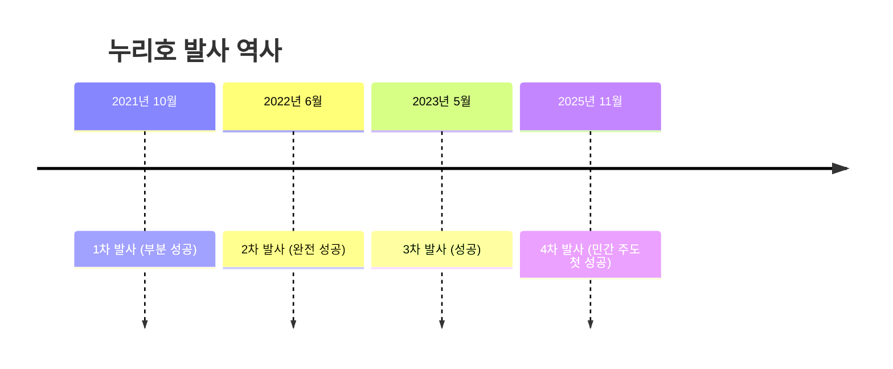
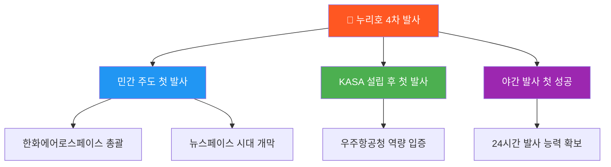
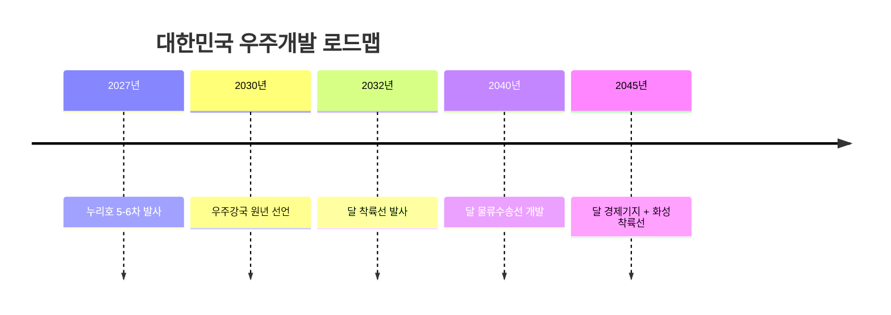
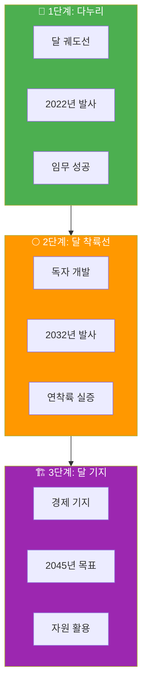

*2025년, 대한민국이 우주를 향해 나아갑니다*

## 2025년, K-우주의 역사적인 해

> "15년 8개월의 노력이 18분 52초 만에 결실을 맺었습니다"
> — 누리호 4차 발사 성공

2025년 11월 27일 새벽 1시 13분, 전남 고흥 나로우주센터에서 **순수 국내 기술**로 개발한 한국형 발사체 '누리호'가 4번째 발사에 성공했습니다.

---

## 1. 누리호 4차 발사 성공

### 역사적인 순간



### 4차 발사 핵심 정보

| 항목 | 내용 |
|------|------|
| **발사일** | 2025년 11월 27일 01:13 |
| **발사장소** | 전남 고흥 나로우주센터 |
| **비행시간** | 18분 52초 |
| **주관** | 한화에어로스페이스 (민간 첫 주관) |
| **탑재체** | 차세대중형위성 3호 + 큐브위성 12기 |
| **목표 궤도** | 600km |

### 왜 4차 발사가 특별한가?



> 이번 4차 발사는 **민간기업이 주도한 첫 발사**라는 점에서 대한민국 우주개발 역사의 새 장을 열었습니다.

---

## 2. 우주항공청(KASA) 출범

### KASA란?

| 구분 | 내용 |
|------|------|
| **영문명** | Korea AeroSpace Administration |
| **설립일** | 2024년 5월 27일 |
| **소속** | 과학기술정보통신부 산하 외청 |
| **산하기관** | 항공우주연구원(KARI), 천문연구원 |
| **역할** | 우주항공기술 확보, 산업 진흥, 우주위험 대비 |

### KASA vs NASA 비교


---

## 3. 다누리: 대한민국 최초 달 궤도선

### 다누리 미션 현황

| 항목 | 상세 |
|------|------|
| **발사일** | 2022년 8월 5일 |
| **발사체** | SpaceX Falcon 9 |
| **궤도** | 달 상공 100km |
| **원래 임무기간** | 1년 |
| **연장 임무** | 2025년 12월까지 (2년 연장) |

### 다누리가 보내온 성과

1. **달 표면 고해상도 촬영** - 착륙 후보지 탐색
2. **영구음영지역 관측** - 얼음 존재 확인
3. **우주인터넷 시험** - BTS 다이너마이트 전송 성공
4. **자기장 측정** - 달 과학 데이터 축적

---

## 4. 2045년까지 우주개발 로드맵

### 핵심 목표



### 분야별 전략

| 분야 | 목표 | 핵심 과제 |
|------|------|----------|
| **우주수송** | 재사용 발사체 | 누리호 고도화 |
| **인공위성** | 초고해상도 | 0.3m급 정밀관측 |
| **우주탐사** | 달·화성 탐사 | 독자 착륙 기술 |
| **우주과학** | 태양권 관측 | L4 관측소 구축 |

### 달 탐사 2단계 계획



---

## 5. 민간 우주기업 생태계

### 누리호 참여 기업

| 기업 | 역할 | 담당 |
|------|------|------|
| **한화에어로스페이스** | 체계종합 | 발사체 제작·조립 총괄 |
| **KAI** | 구조체 | 페어링, 위성 탑재부 |
| **HD현대중공업** | 발사대 | 발사장 시설 |
| **AP위성** | 위성 | 큐브위성 개발 |

### K-스페이스 스타트업

| 기업 | 분야 | 특징 |
|------|------|------|
| **이노스페이스** | 소형 발사체 | 한빛-TLV 개발 |
| **페리지에어로스페이스** | 소형 발사체 | Blue Whale 개발 |
| **컨텍** | 위성 | 초소형 SAR 위성 |
| **나라스페이스** | 위성 | 지구관측 위성 |

---

## 6. 글로벌 우주 경쟁 현황

### 주요국 달 탐사 계획

```mermaid
xychart-beta
    title "달 착륙 목표 연도"
    x-axis [미국, 중국, 일본, 인도, 한국]
    y-axis "목표 연도" 2025 --> 2040
    bar [2026, 2030, 2030, 2028, 2032]
```

### 우주 예산 비교 (2025년)

| 국가 | 연간 예산 | 특징 |
|------|----------|------|
| 🇺🇸 미국 | $25.4B | 압도적 1위 |
| 🇨🇳 중국 | $14B+ | 급성장 |
| 🇪🇺 유럽 | $7.5B | ESA 협력 |
| 🇯🇵 일본 | $3.5B | JAXA |
| 🇰🇷 한국 | $0.8B | KASA 신설 |

---

## 7. 우주산업 경제 효과

### K-스페이스 시장 전망

| 연도 | 시장 규모 | 성장률 |
|------|----------|--------|
| 2023년 | 4.6조 원 | - |
| 2025년 | 5.5조 원 | +19% |
| 2030년 | 10조 원 | +82% |
| 2040년 | 30조 원 | +200% |

### 우주산업 파급효과

1. **일자리 창출** - 고급 기술인력 수요
2. **기술 스핀오프** - 민간 기술 이전
3. **국제 협력** - 글로벌 프로젝트 참여
4. **안보 강화** - 정찰위성, 통신위성

---

## 8. 일반인도 갈 수 있는 우주

### 우주관광 시대

```
🚀 우주여행 가격 변화

2021년: $5,500만 (버진 갤럭틱)
2024년: $45만 (스페이스X 크루드래곤)
2030년: $10만 (예상)
2040년: $1만 (목표)

"언젠가 비행기 타듯 우주를 갈 수 있는 날이 옵니다"
```

### 한국인 우주비행 전망

| 시기 | 가능성 | 방법 |
|------|--------|------|
| 2027년 | 민간 우주관광 | SpaceX 탑승 |
| 2030년대 | 국제 협력 | ISS/중국 우주정거장 |
| 2040년대 | 독자 유인우주 | 한국형 유인선 |

---

## 9. 우주 관련 진로/취업

### 유망 직종

| 직종 | 필요 역량 | 전망 |
|------|----------|------|
| **우주공학자** | 항공우주공학 | ⭐⭐⭐⭐⭐ |
| **위성 개발자** | 전자/통신공학 | ⭐⭐⭐⭐⭐ |
| **로켓 엔지니어** | 기계/추진공학 | ⭐⭐⭐⭐⭐ |
| **우주 데이터 분석가** | 데이터사이언스 | ⭐⭐⭐⭐ |
| **우주법 전문가** | 법학/국제법 | ⭐⭐⭐⭐ |

### 관련 학과

- 항공우주공학과
- 천문학과
- 기계공학과
- 전자공학과
- 컴퓨터공학과

---

## 10. 결론: K-우주의 미래

### 2025년 핵심 성과

| # | 성과 |
|---|------|
| 1 | 누리호 4차 발사 성공 (민간 주도 첫 성공) |
| 2 | 우주항공청(KASA) 본격 가동 |
| 3 | 다누리 연장 임무 수행 |
| 4 | 2045년 로드맵 확정 |
| 5 | 민간 우주기업 생태계 성장 |

### 앞으로의 일정

```
📅 K-우주 주요 일정

2027년: 누리호 5차, 6차 발사
2030년: 우주강국 원년 선언
2032년: 달 착륙선 발사
2040년: 달 물류수송선
2045년: 달 기지 + 화성 착륙선

"별을 향해 손을 뻗으면, 달에는 닿을 수 있다"
```


*K-우주의 무한한 가능성*

---

**우주 개발에 대해 더 궁금한 점이 있으신가요?** 댓글로 남겨주세요!

---

## 참고 자료

- [한국항공우주연구원 - 누리호](https://www.kari.re.kr/kor/contents/51)
- [우주항공청 공식 사이트](https://www.kasa.go.kr/)
- [사이언스타임스 - 누리호 4차 발사 성공](https://www.sciencetimes.co.kr/nscvrg/view/menu/252?searchCategory=224&nscvrgSn=261196)
- [정책브리핑 - 누리호 4차 발사](https://www.korea.kr/news/policyNewsView.do?newsId=148955460)
- [뉴스스페이스 - 2045년 달 기지 화성 착륙선](https://www.newsspace.kr/news/article.html?no=8054)
