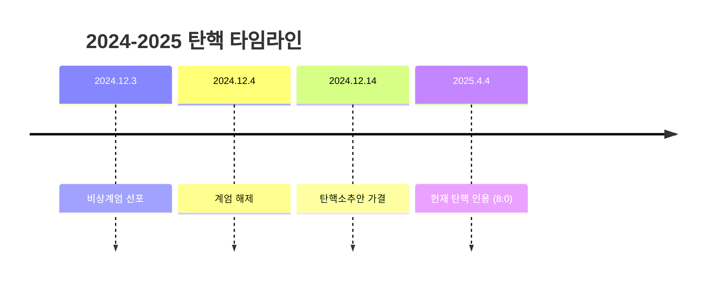
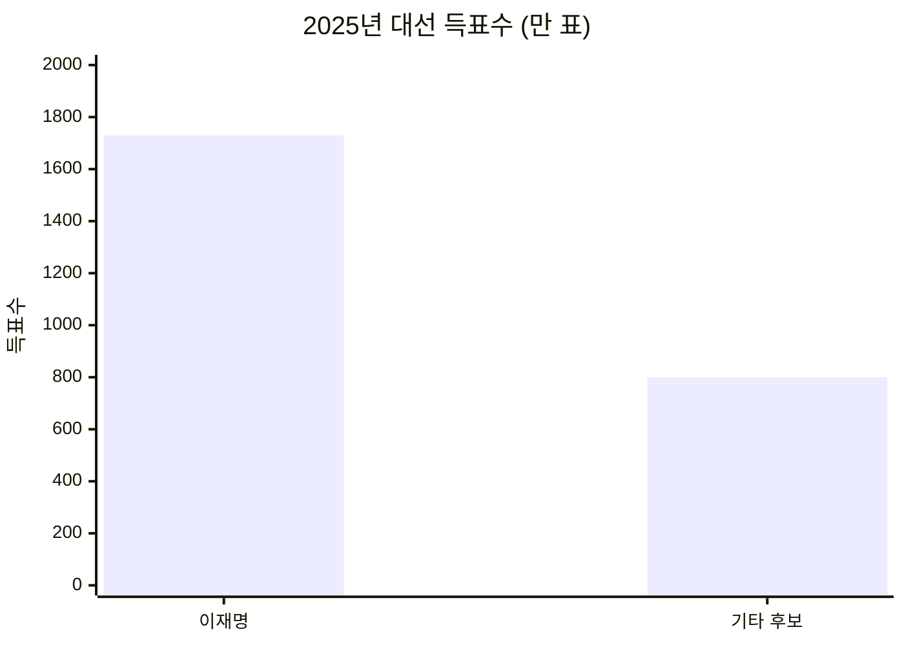
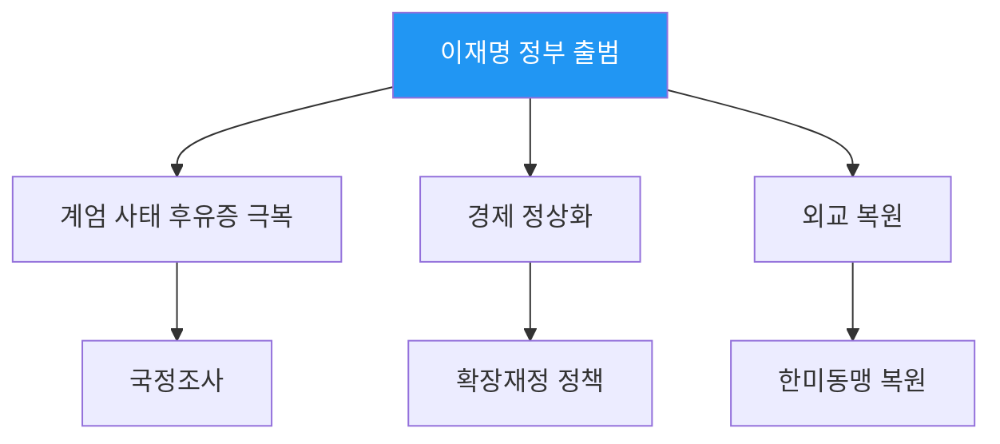
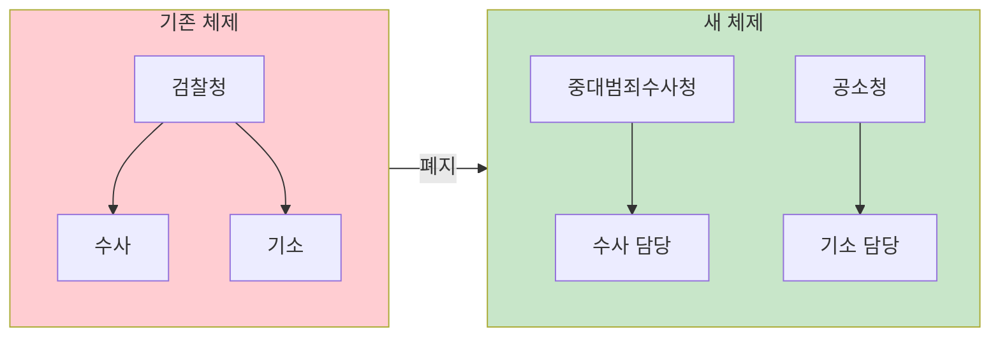
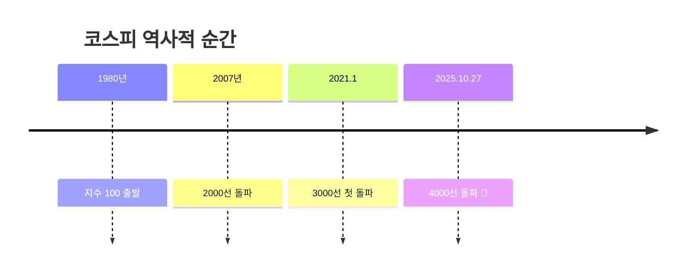
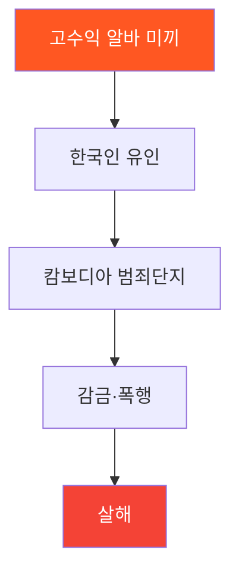
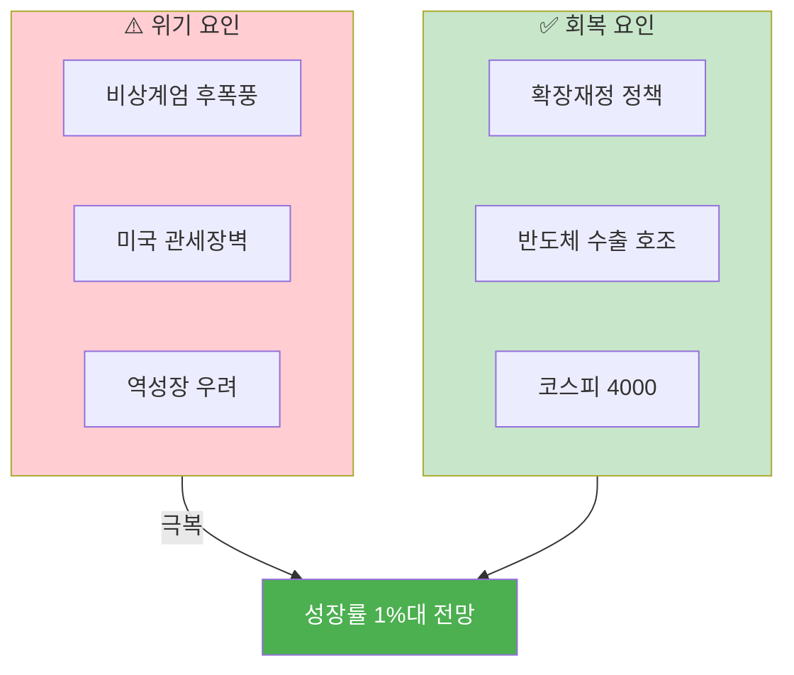
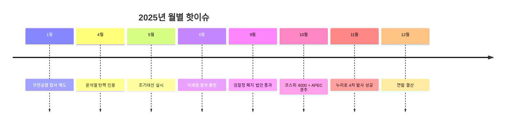

*2025년, 대한민국 역사가 다시 쓰여진 해*

## 2025년, 대격변의 해

> "122일 만에 탄핵, 78년 만에 검찰청 폐지, 45년 만에 코스피 4000"
> — 역사적 전환점의 연속

2025년은 대한민국 헌정사에 길이 남을 해였습니다. 정치, 경제, 사회 전 분야에서 전례 없는 변화가 일어났습니다.

---

## 1. 윤석열 대통령 탄핵

### 122일 만의 파면



| 항목 | 내용 |
|------|------|
| **탄핵 결정일** | 2025년 4월 4일 |
| **재판관 의견** | 8명 전원 일치 인용 |
| **소요 기간** | 비상계엄 후 122일 |
| **효력** | 즉시 발생 |

> 대한민국 헌정사 두 번째 대통령 탄핵 인용

---

## 2. 이재명 정부 출범

### 역대 최다 득표



| 항목 | 내용 |
|------|------|
| **득표수** | 1,728만 7,513표 |
| **기록** | 역대 최다 득표 |
| **정부 명칭** | 국민주권 정부 |
| **1호 행정명령** | 비상경제점검TF |

### 국정 정상화 추진



---

## 3. 검찰청 폐지

### 78년 역사의 종말

| 항목 | 내용 |
|------|------|
| **법안 통과** | 2025년 9월 국회 |
| **검찰청 역사** | 1948년~2025년 (78년) |
| **핵심 내용** | 수사·기소 분리 |

### 새로운 체제



---

## 4. 코스피 4000 돌파

### 45년 만의 이정표



| 항목 | 수치 |
|------|------|
| **돌파일** | 2025년 10월 27일 |
| **3000→4000** | 약 4년 10개월 |
| **100→4000** | 45년 |

> "사천피 시대" 개막!

---

## 5. APEC 경주 개최

### 20년 만의 한국 APEC

| 항목 | 내용 |
|------|------|
| **개최지** | 경주 |
| **시기** | 2025년 10월 말 |
| **참가국** | 21개국 정상 |
| **의미** | 한국 20년 만의 APEC |

### 외교 성과

- 세계 21개국 정상 한자리 집결
- 한국 외교력 과시
- 경주 문화유산 홍보

---

## 6. 캄보디아 납치·살해 사건

### 충격의 연쇄 범죄



| 사건 내용 | 상세 |
|----------|------|
| **수법** | 고수익 아르바이트 위장 |
| **장소** | 캄보디아 범죄 단지 |
| **피해** | 한국인 납치·살해 |

> 해외 취업 사기 경각심 고조

---

## 7. 무안공항 제주항공 참사

### 항공사고 최다 희생

| 항목 | 수치 |
|------|------|
| **발생일** | 2024년 12월 29일 |
| **탑승객** | 181명 |
| **사망자** | 179명 |
| **기록** | 한국 항공사고 사상 최다 |

> 전 국민 애도 속 항공안전 강화 논의

---

## 8. 경제: 내우외환 속 회복

### 2025년 경제 상황



| 지표 | 상황 |
|------|------|
| **연초** | 역성장 우려 |
| **회복 동력** | 반도체 수출 |
| **정책** | 확장재정 |
| **연말 전망** | 성장률 1%대 |

---

## 9. 기후재난 일상화

### 2025년 재해 현황

| 재해 유형 | 발생 |
|----------|------|
| **산불** | 대형 산불 다수 |
| **극한 호우** | 기록적 폭우 |
| **전산망 마비** | 국정자원 화재 |

> 기후위기가 더 이상 먼 미래가 아님을 실감

---

## 10. 대중문화계 격변

### K-콘텐츠 확장

| 분야 | 2025년 동향 |
|------|------------|
| **K-드라마** | 넷플릭스 글로벌 강세 |
| **K-POP** | 글로벌 팬덤 확대 |
| **한국 영화** | 흥행 부침 |
| **연예계** | 굵직한 사건 다수 |

---

## 2025년 월별 주요 이슈



---

## 2025년 vs 2024년 비교

| 항목 | 2024년 | 2025년 |
|------|--------|--------|
| **정치** | 비상계엄 | 정권 교체 |
| **코스피** | 2500대 | 4000 돌파 |
| **출산율** | 0.72 | 0.75 (반등) |
| **우주** | 준비 | 누리호 4차 성공 |

---

## 2026년 전망

### 주목할 이슈

```
📅 2026년 주요 일정

【정치】
☐ 지방선거 (6월)
☐ 검찰청 폐지 시행
☐ 중수청·공소청 출범

【경제】
☐ 코스피 5000 도전?
☐ 반도체 슈퍼사이클 지속
☐ 금리 정상화

【사회】
☐ 출산율 추가 반등 기대
☐ 기후대응 정책 강화
☐ 늘봄학교 전 학년 확대
```

---

## 결론: 격변 속 희망

### 2025년 핵심 키워드

| # | 키워드 | 의미 |
|---|--------|------|
| 1 | **탄핵** | 헌정 질서 회복 |
| 2 | **정권교체** | 새 정부 출범 |
| 3 | **4000** | 코스피 역사적 이정표 |
| 4 | **반등** | 출산율 9년 만에 상승 |
| 5 | **개혁** | 검찰청 폐지 |

```
2025년을 한 문장으로:
"대한민국이 위기를 딛고 새로운 시대를 열다"

정치: 탄핵 → 조기대선 → 새 정부
경제: 역성장 우려 → 코스피 4000
사회: 저출산 → 9년 만에 반등
기술: 누리호 → 민간 주도 첫 성공
```


*역사가 쓰여지는 순간들*

---

**2025년 가장 기억에 남는 뉴스는 무엇인가요?** 댓글로 공유해주세요!

---

## 참고 자료

- [뉴시스 - 2025년 국내 10대 뉴스](https://www.newsis.com/view/NISX20251217_0003444475)
- [코리아넷 - 2025년 10대 뉴스](https://www.korean-culture.org/koreanet/view.do?seq=1053330)
- [다음 이슈 - 2025 연말결산](https://issue.daum.net/focus/2025recap-issue)
- [정책브리핑 - 2025년 12월 경제동향](https://www.korea.kr/news/policyNewsView.do?newsId=156734814)
