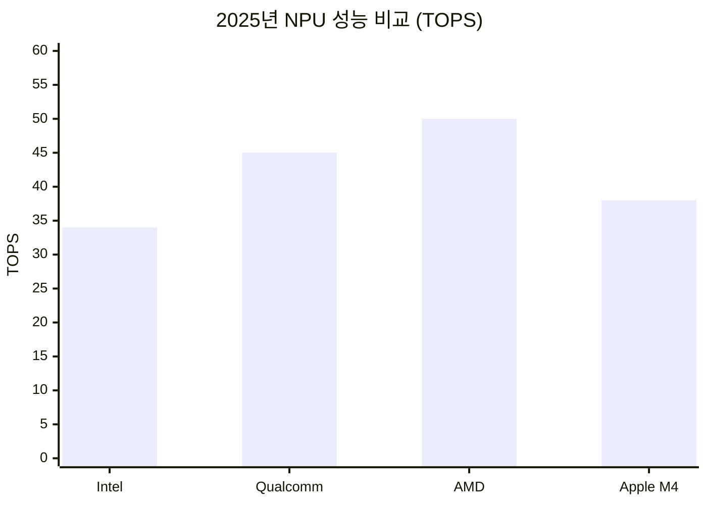

import StatCard from "@/components/widgets/StatCard.astro";
import ComparisonTable from "@/components/widgets/ComparisonTable.astro";
import HighlightBox from "@/components/widgets/HighlightBox.astro";
import QuoteBox from "@/components/widgets/QuoteBox.astro";
import TimelineItem from "@/components/widgets/TimelineItem.astro";


*2025년, 노트북 선택의 기준이 완전히 바뀌었습니다*

## 2025년 노트북 시장, 한눈에 보기

<QuoteBox author="2025년 노트북 구매자들의 질문">
NPU가 뭔데? AI PC는 왜 사야 해?
</QuoteBox>


*새 노트북 고르는 중*

---

## 1. 2025년은 AI PC 원년

### AI PC란?

<HighlightBox title="AI PC의 정의" variant="info">
핵심: NPU (Neural Processing Unit) 탑재

**NPU가 하는 일:**
- 로컬에서 AI 연산
- 클라우드 없이 AI 실행
- 저전력 고효율
- 개인정보 보호

**"클라우드 없이도 AI가 돌아간다"**
</HighlightBox>

*출처: [SkyHan](https://skyhansig.com/entry/2025년-AI-PC-완벽-가이드-NPU-Copilot-PC-온디바이스-AI의-모든-것-AMD-Intel-Qualcomm-프로세서-비교와-최고의-AI-노트북-추천까지)*

### AI PC 장점

<ComparisonTable
  headers={["장점", "설명"]}
  rows={[
    ["생산성", "AI 도우미가 반복 작업 자동화"],
    ["배터리", "NPU 덕분에 하루 종일 사용"],
    ["프라이버시", "로컬 AI로 데이터 보호"],
    ["속도", "클라우드 지연 없는 즉시 실행"]
  ]}
/>

### 시장 전망

<StatCard
  value="35%"
  label="전 세계 PC 출하량 중 AI PC 비중 (2025)"
  trend="up"
  description="교체 수요 급증: Windows 10 지원 종료(2025.10), AI 기능 탑재 신제품, 배터리 효율 개선"
/>


*AI가 탑재된 노트북*

---

## 2. 맥북 M4 시리즈 (2025)

### MacBook Air M4

<HighlightBox title="MacBook Air M4 (2025.3 출시)" variant="success">
**칩: Apple M4**
- CPU: 10코어
- GPU: 10코어
- Neural Engine: 16코어

**사양:**
- RAM: 최대 32GB
- SSD: 최대 2TB
- 디스플레이: 13.6" Liquid Retina
- 배터리: 18시간+
- 색상: 스카이 블루 추가!

**포트:**
- MagSafe 3
- Thunderbolt 4 x2
- 3.5mm 오디오
- Wi-Fi 6E

**"가장 얇은 AI 노트북"**
</HighlightBox>

*출처: [Shareitem](https://shareitem.co.kr/2025%EB%85%84-%EB%A7%A5%EB%B6%81%EC%9D%84-%EC%84%A0%ED%83%9D%ED%95%B4%EC%95%BC-%ED%95%98%EB%8A%94-%EC%9D%B4%EC%9C%A0-%EC%9C%88%EB%8F%84%EC%9A%B0%EC%99%80%EB%8A%94-%EC%B0%A8%EC%9B%90%EC%9D%B4/)*

### MacBook Pro M4 Pro/Max

<ComparisonTable
  headers={["모델", "용도", "가격대"]}
  rows={[
    ["M4", "일반 사용", "~200만원"],
    ["M4 Pro", "영상 편집, 개발", "~300만원"],
    ["M4 Max", "3D, AI 학습", "~500만원+"]
  ]}
/>

<QuoteBox>
이전 세대 대비 CPU/GPU 성능 비약적 향상
</QuoteBox>

---

## 3. Windows AI PC: Copilot+ PC

### ARM 기반 혁신

<HighlightBox title="Copilot+ PC (Surface Laptop)" variant="info">
**핵심 변화:**
- 인텔 CPU → ARM CPU 채용
- 전력 효율 대폭 개선
- 맥북급 배터리 수명
- 쿨링팬 소음 감소

**ARM의 장점:**
- 인텔보다 훨씬 적은 전력
- 성능은 곱절로 빠름
- 얇고 가벼운 디자인
- 발열 감소

**"마이크로소프트가 인텔을 버렸다"**
</HighlightBox>

*출처: [엔지니어 노트북 추천](https://wisegetter.com/laptop-5-recommendations-by-engineer/)*

### Copilot+ 기능

<ComparisonTable
  headers={["기능", "설명"]}
  rows={[
    ["Recall", "과거 화면 검색"],
    ["Cocreator", "AI 이미지 생성"],
    ["Live Captions", "실시간 번역 자막"],
    ["AI Effects", "화상회의 효과"]
  ]}
/>


*Copilot+ PC 사용 중*

---

## 4. 개발자를 위한 노트북

### 2025년 개발용 기준

<HighlightBox title="개발자 노트북 선택 기준 2025" variant="warning">
**과거:** CPU 클럭이 핵심
**현재:** NPU + 통합 메모리가 핵심

**추천 전략:**
- CPU 한 등급 낮추더라도
- RAM 32GB로 올리기
- NPU 탑재 확인
- SSD 1TB 이상

**"2025년 개발자 가장 현명한 투자"**
</HighlightBox>

*출처: [노마드랩](https://nomadlab.kr/168)*

### 맥북 vs 윈도우 (개발용)

<ComparisonTable
  headers={["항목", "맥북", "윈도우"]}
  rows={[
    ["iOS 개발", "⭐⭐⭐⭐⭐", "❌"],
    ["웹 개발", "⭐⭐⭐⭐⭐", "⭐⭐⭐⭐"],
    ["AI/ML", "⭐⭐⭐", "⭐⭐⭐⭐⭐ (CUDA)"],
    ["게임 개발", "⭐⭐", "⭐⭐⭐⭐⭐"],
    ["3D 렌더링", "⭐⭐⭐⭐", "⭐⭐⭐⭐⭐"]
  ]}
/>

<QuoteBox>
AI 학습/딥러닝은 CUDA 호환성 때문에 Windows가 유리
</QuoteBox>

---

## 5. 용도별 노트북 추천

### 2025년 TOP 5 추천

<HighlightBox title="용도별 노트북 추천 2025" variant="success">
**【학생용 가성비】**
LG 울트라PC 15U70R-GX56K
- 가격: ~90만원
- 충분한 성능
- 가벼운 무게

**【직장인 휴대용】**
삼성 갤럭시북4 프로
- AMOLED 디스플레이
- 20시간+ 배터리
- 초경량

**【영상 편집/크리에이터】**
애플 맥북 프로 M4 14인치
- 4K 영상 편집
- 파이널컷 최적화
- ProRes 가속

**【업무용 고성능】**
씽크패드 X1 카본 Gen 13
- 인텔 15세대
- 32GB LPDDR5X
- 기업용 보안

**【게이밍/크리에이터】**
ROG 제피러스 G16 2025
- AMD 라이젠 9000
- RTX 5080 GPU
- 240Hz 디스플레이
</HighlightBox>

*출처: [고성능 노트북 추천](https://brunch.co.kr/@nutritional/19)*

### 가격대별 추천

<ComparisonTable
  headers={["예산", "추천", "용도"]}
  rows={[
    ["~100만", "LG 울트라PC", "학생, 사무"],
    ["~200만", "맥북 에어 M4", "일반, 개발"],
    ["~300만", "맥북 프로 M4", "크리에이터"],
    ["~400만+", "ROG 제피러스", "게이밍, 3D"]
  ]}
/>


*노트북 고르는 중*

---

## 6. AI 개발용 노트북

### 딥러닝/ML 전용

<HighlightBox title="AI 개발용 노트북 선택" variant="info">
**필수 사양:**
- GPU: NVIDIA RTX 4080 이상
- RAM: 32GB 이상
- VRAM: 12GB 이상
- SSD: 1TB NVMe
- 발열 관리 중요

**추천 모델:**
- Razer Blade 18
- ASUS ProArt Studiobook
- MSI Creator Z17
- Lenovo ThinkPad P1

**macOS 대안:**
- MacBook Pro M4 Max
- MLX 프레임워크 활용
- Metal 가속
</HighlightBox>

*출처: [AI 개발용 노트북 추천](https://insightful-portal.com/entry/2025년-AI-개발용-노트북-추천-성능과-확장성을-고려한-최적의-선택)*

### GPU 비교

<ComparisonTable
  headers={["GPU", "VRAM", "AI 성능"]}
  rows={[
    ["RTX 4060", "8GB", "입문"],
    ["RTX 4070", "8GB", "중급"],
    ["RTX 4080", "12GB", "고급"],
    ["RTX 4090", "16GB", "최상급"]
  ]}
/>

---

## 7. NPU 프로세서 비교

### AMD vs Intel vs Qualcomm



<ComparisonTable
  headers={["프로세서", "TOPS", "강점"]}
  rows={[
    ["Qualcomm X Elite", "45", "전력 효율 최고"],
    ["Intel Core Ultra", "34", "x86 호환성"],
    ["AMD Ryzen AI", "50+", "그래픽/가성비"],
    ["Apple M4", "38", "생태계 통합"]
  ]}
/>

*출처: [SkyHan AI PC 가이드](https://skyhansig.com/entry/2025년-AI-PC-완벽-가이드-NPU-Copilot-PC-온디바이스-AI의-모든-것-AMD-Intel-Qualcomm-프로세서-비교와-최고의-AI-노트북-추천까지)*

### 선택 가이드

<ComparisonTable
  headers={["우선순위", "추천"]}
  rows={[
    ["배터리", "Qualcomm"],
    ["호환성", "Intel"],
    ["성능", "AMD"],
    ["Apple 생태계", "M4"]
  ]}
/>

---

## 8. 구매 시기 전략

### 언제 사야 할까?

<HighlightBox title="2025 노트북 구매 시기" variant="warning">
**【지금 구매 추천】**
- 교체 주기 된 경우
- 크리에이터/전문가
- Windows 10 종료 대비
- 급하게 필요한 경우

**【6개월 대기 추천】**
- 가격 하락 기다림
- 게이머 (RTX 50 시리즈)
- 현재 노트북 사용 가능
- 신제품 대기

**【1년 대기 추천】**
- 현재 노트북 만족
- 간단한 작업만
- 예산 여유 없음
- 다음 세대 대기
</HighlightBox>

*출처: [다나와 DPG](https://dpg.danawa.com/news/view?boardSeq=63&listSeq=5858695)*

---

## 9. 구매 전 체크리스트

### 필수 확인 사항

<HighlightBox title="노트북 구매 체크리스트" variant="info">
**【기본】**
- ☐ 용도 명확히 (게임? 업무? 개발?)
- ☐ 예산 설정
- ☐ 무게/휴대성 중요도
- ☐ 화면 크기 선호

**【사양】**
- ☐ RAM: 16GB 최소, 32GB 추천
- ☐ SSD: 512GB 최소, 1TB 추천
- ☐ 디스플레이: FHD 이상
- ☐ 배터리: 10시간 이상

**【AI PC】**
- ☐ NPU 탑재 여부
- ☐ Copilot+ 지원
- ☐ AI 기능 필요성
- ☐ 향후 활용 계획
</HighlightBox>

---

## 10. 결론: 2025 노트북 선택 가이드

### 핵심 포인트

<ComparisonTable
  headers={["#", "인사이트"]}
  rows={[
    ["1", "AI PC 시대 = NPU 탑재 필수"],
    ["2", "맥북 M4 = 배터리/성능 최강"],
    ["3", "Copilot+ = ARM 기반 혁신"],
    ["4", "RAM 32GB = 2025년 표준"],
    ["5", "Windows 10 종료 = 교체 시즌"]
  ]}
/>

### 용도별 한줄 추천

```
학생: LG 울트라PC (~90만)
직장인: 갤럭시북4 프로
개발자: 맥북 프로 M4
크리에이터: 맥북 프로 M4 Max
게이머: ROG 제피러스 G16
AI 개발: RTX 4080+ 탑재 노트북
```

### 밈으로 정리

```
2020년: "인텔 i7이면 충분해"
2025년: "NPU 없으면 구시대"

2020년: "8GB면 충분하지?"
2025년: "32GB가 새로운 16GB"

2020년: "맥북은 비싸기만..."
2025년: "맥북 배터리가 미쳤어"
```


---

**다음 노트북으로 뭘 사실 계획인가요?** 댓글로 공유해주세요!

---

## 참고 자료

- [SkyHan - AI PC 완벽 가이드](https://skyhansig.com/entry/2025년-AI-PC-완벽-가이드-NPU-Copilot-PC-온디바이스-AI의-모든-것-AMD-Intel-Qualcomm-프로세서-비교와-최고의-AI-노트북-추천까지)
- [노마드랩 - 개발자 NPU 노트북](https://nomadlab.kr/168)
- [Wisegetter - 엔지니어 노트북 추천](https://wisegetter.com/laptop-5-recommendations-by-engineer/)
- [Shareitem - 맥북 선택 이유](https://shareitem.co.kr/2025%EB%85%84-%EB%A7%A5%EB%B6%81%EC%9D%84-%EC%84%A0%ED%83%9D%ED%95%B4%EC%95%BC-%ED%95%98%EB%8A%94-%EC%9D%B4%EC%9C%A0-%EC%9C%88%EB%8F%84%EC%9A%B0%EC%99%80%EB%8A%94-%EC%B0%A8%EC%9B%90%EC%9D%B4/)
- [Brunch - 고성능 노트북 추천](https://brunch.co.kr/@nutritional/19)
- [다나와 DPG - 2025 노트북](https://dpg.danawa.com/news/view?boardSeq=63&listSeq=5858695)
- [AI 개발용 노트북](https://insightful-portal.com/entry/2025년-AI-개발용-노트북-추천-성능과-확장성을-고려한-최적의-선택)
