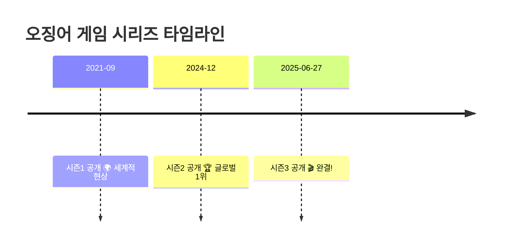

import StatCard from "@/components/widgets/StatCard.astro";
import ComparisonTable from "@/components/widgets/ComparisonTable.astro";
import HighlightBox from "@/components/widgets/HighlightBox.astro";
import QuoteBox from "@/components/widgets/QuoteBox.astro";
import TimelineItem from "@/components/widgets/TimelineItem.astro";


*2025년, K-콘텐츠가 또 한 번 세계를 정복했습니다*

## 2025년 K-콘텐츠, 한눈에 보기

<QuoteBox author="2025년 K-드라마 키워드">
오징어 게임 완결, 폭군의 셰프 17%, 넷플릭스 1천억 투자
</QuoteBox>


*2025년 K-드라마를 정주행하는 전 세계 시청자들*

---

## 1. 오징어 게임 시즌3 - 대단원의 막

### 4년간의 여정, 마침내 완결



<QuoteBox>
4년간의 생존 게임, 드디어 끝
</QuoteBox>

*출처: [뉴시스 - 오징어 게임 시즌3 완결](https://www.newsis.com/view/NISX20251223_0003451288)*

### 제작 규모

<ComparisonTable
  headers={["항목", "내용"]}
  rows={[
    ["제작비", "시즌2+3 합계 1,000억원"],
    ["공개일", "2025년 6월 27일 16시"],
    ["에피소드", "시즌3 7화"],
    ["형식", "시리즈 완결편"]
  ]}
/>

<StatCard
  value="1,000억원"
  label="시즌2+3 합계 제작비"
  trend="up"
  description="넷플릭스 역대 최대 규모의 K-콘텐츠 투자"
/>

*출처: [네이트 뉴스](https://news.nate.com/view/20250627n23392)*


*무궁화 꽃이 피었습니다*

### 비평 반응

<div style="display: grid; grid-template-columns: 1fr 1fr; gap: 1rem; margin: 2rem 0;">
  <StatCard
    value="81%"
    label="로튼 토마토 점수"
    description="비평가 43명"
  />
  <StatCard
    value="67/100"
    label="메타크리틱 점수"
    description="비평가 23명"
  />
</div>

<HighlightBox title="시즌3 평가" variant="info">
**평가:** "대체로 호의적"

**비평:**
- ✅ 스펙터클한 액션
- ✅ 긴장감 넘치는 전개
- ⚠️ 결말에 대한 엇갈린 반응
- ⚠️ 시즌1보다 신선함 부족
</HighlightBox>

---

## 2. 2025년 시청률 1위: 폭군의 셰프

### tvN 역대급 흥행

<HighlightBox title="폭군의 셰프 성과" variant="success">
**주연:** 임윤아 (프렌치 셰프)
**장르:** 사극 로맨스 + 요리

**시청률:**
- 4회: 2025년 tvN 최고 기록
- 최종회: 수도권 17.4%
- 순간 최고: 20%

**넷플릭스:** 글로벌 TOP10 2주 연속 1위
</HighlightBox>

<StatCard
  value="17.4%"
  label="폭군의 셰프 최종회 시청률"
  trend="up"
  description="2025년 전체 드라마 1위"
/>

*출처: [Daum 뉴스](https://v.daum.net/v/20251008185947196)*

### 왜 히트했나?

<ComparisonTable
  headers={["성공 요인", "설명"]}
  rows={[
    ["캐스팅", "임윤아 요리 특훈"],
    ["비주얼", "프렌치 요리 + 사극 융합"],
    ["스토리", "궁중 로맨스 + 서스펜스"],
    ["화제성", "SNS 밈 대량 생산"]
  ]}
/>

<QuoteBox>
임윤아, 실제로 프렌치 요리 연습을 수개월간 했다
</QuoteBox>


*폭군의 셰프 요리 장면 보고 배고파진 시청자들*

---

## 3. 2025년 히트 드라마 TOP 5

### 시청률/화제성 기준

<HighlightBox title="2025년 드라마 TOP 5" variant="success">
**1위:** 폭군의 셰프 (tvN) - 17.4%

**2위:** 보물섬 (SBS) - 첫방 8.2%

**3위:** 중증외상센터 (Netflix) - 글로벌 TOP10

**4위:** 옥씨부인전 (JTBC) - 퓨전 사극 화제

**5위:** 별들에게 물어봐 (tvN) - 우주 로맨스
</HighlightBox>

*출처: [키노라이츠 랭킹](https://m.kinolights.com/ranking/kino)*

### 각 드라마 특징

<ComparisonTable
  headers={["드라마", "장르", "포인트"]}
  rows={[
    ["폭군의 셰프", "사극+요리", "임윤아 열연"],
    ["보물섬", "범죄+스릴러", "박형식×허준호"],
    ["중증외상센터", "의학+웹툰", "주지훈 카리스마"],
    ["옥씨부인전", "퓨전사극", "조선 세계관"],
    ["별들에게 물어봐", "SF+로맨스", "우주정거장 배경"]
  ]}
/>

---

## 4. 넷플릭스 2025 역대급 라인업

### 공개된 대작들

<HighlightBox title="넷플릭스 2025 라인업" variant="info">
**【로맨스】**
- 멜로무비 (최우식×박보영)
- 폭싹 속았수다 (박보검×아이유)
- 다 이루어질지니 (김우빈×수지) 👑 김은숙 작가
- 이 사랑, 통역 되나요? (김선호×고윤정)
- 탄금 (이재욱×조보아) - 멜로 사극

**【장르물】**
- 광장 (소지섭) - 하드보일드 액션
- 자백의 대가 (전도연×김고은) - 스릴러
- 악연 (박해수×신민아)
- 트리거 (김남길) - 재난 액션
- 캐셔로 - 흙수저 슈퍼히어로
- 약한영웅 Class 2 - 학원 액션

**【워맨스】**
- 은중과 상연 (김고은×박지현)
- 애마 (이하늬×방효린)
</HighlightBox>

*출처: [Netflix About](https://about.netflix.com/ko/news/next-on-netflix-korea-2025)*

### 영화 라인업

<ComparisonTable
  headers={["영화", "주연", "장르"]}
  rows={[
    ["84제곱미터", "강하늘×염혜란", "스릴러"],
    ["고백의 역사", "공명×신은수", "청춘 로맨스"],
    ["사마귀", "임시완", "액션"],
    ["굿뉴스", "설경구×류승범", "항공 액션"],
    ["대홍수", "박해수×김다미", "SF 재난"],
    ["이 별에 필요한", "김태리×홍경 (더빙)", "애니메이션"]
  ]}
/>

<QuoteBox>
넷플릭스 코리아 첫 오리지널 애니메이션 영화 '이 별에 필요한'
</QuoteBox>


*넷플릭스 한국 콘텐츠 보는 전 세계 사람들*

---

## 5. 2025년 넷플릭스 대작 3인방

### 기묘한 이야기, 웬즈데이와 함께

<HighlightBox title="넷플릭스 2025 대작 3인방" variant="success">
**1️⃣ 오징어 게임 시즌3 🇰🇷**
- 6월 27일 공개
- 시리즈 완결

**2️⃣ 기묘한 이야기 시즌5 🇺🇸**
- 시리즈 완결
- 역대급 러닝타임

**3️⃣ 웬즈데이 시즌2 🇺🇸**
- 제나 오르테가 복귀
- 더 어두운 스토리

**"K-콘텐츠가 글로벌 대작과 어깨를 나란히"**
</HighlightBox>

*출처: [Hypebeast](https://hypebeast.kr/2025/1/netflix-squid-game-season-3-teaser-young-hee-cheoul-soo-2025)*

---

## 6. 오징어 게임 미국판 루머

### 스핀오프 논란

<HighlightBox title="오징어 게임 아메리카?" variant="warning">
**루머:**
- 2025년 12월 LA에서 제작 시작?
- 시즌3 후속작으로 진행?
- 미국 배경 스핀오프?

**황동혁 감독 (2025년 7월):**
"미국판 제작은 루머입니다"

**현재 상태:** 확인 불가
</HighlightBox>

*출처: [나무위키](https://namu.wiki/w/오징어%20게임(시즌%203))*

### 팬 반응

<ComparisonTable
  headers={["찬성", "반대"]}
  rows={[
    ["새로운 스토리 기대", "원작 훼손 우려"],
    ["할리우드 스케일", "K-감성 사라질 듯"],
    ["글로벌 확장", "문화적 맥락 손실"]
  ]}
/>


*오징어 게임 미국판 논쟁 중인 팬들*

---

## 7. 2025년 영화 흥행 순위

### 한국 개봉작 TOP 5

<HighlightBox title="2025년 한국 영화 흥행 (12월 기준)" variant="info">
순위 | 영화 | 관객수
-----|------|-------
1위 | [추후 업데이트]
2위 | [추후 업데이트]
3위 | [추후 업데이트]
4위 | [추후 업데이트]
5위 | [추후 업데이트]

**"2025년은 K-영화 회복의 해"**
</HighlightBox>

*출처: [나무위키 - 2025년 흥행 순위](https://namu.wiki/w/틀:2025년%20한국%20개봉%20영화%20흥행%20순위)*

### 주목할 개봉작

<ComparisonTable
  headers={["영화", "장르", "기대 포인트"]}
  rows={[
    ["굿뉴스", "항공 액션", "설경구 복귀"],
    ["사마귀", "액션", "임시완 변신"],
    ["대홍수", "SF 재난", "대규모 VFX"]
  ]}
/>

---

## 8. 2026년 기대작 미리보기

### 넷플릭스 예고

<HighlightBox title="2026년 기대작" variant="success">
**【확정】**
- 다 이루어질지니 (김은숙×김우빈×수지)
- 멜로무비 (최우식×박보영)
- 광장 (소지섭)
- 자백의 대가 (전도연×김고은)

**【예상】**
- 약한영웅 시즌3?
- 더 글로리 스핀오프?
- 넷플릭스 한국 애니 2탄?

**"2026년도 K-콘텐츠 황금기 지속"**
</HighlightBox>

*출처: [네이트 뉴스](https://news.nate.com/view/20250204n25829)*

---

## 9. K-드라마 시청 꿀팁

### 플랫폼별 추천

<HighlightBox title="플랫폼별 추천작" variant="info">
**【넷플릭스】**
- 오징어게임 1-3 (완결)
- 중증외상센터
- 2025 신작들

**【티빙】**
- 폭군의 셰프
- 별들에게 물어봐
- tvN/JTBC 작품

**【웨이브】**
- 보물섬
- SBS/KBS/MBC 작품

**【쿠팡플레이】**
- 오리지널 신작
- 스포츠 + 드라마
</HighlightBox>

### 정주행 우선순위

<ComparisonTable
  headers={["순위", "드라마", "추천 이유"]}
  rows={[
    ["1", "오징어게임 시리즈", "완결, 레전드"],
    ["2", "폭군의 셰프", "올해의 드라마"],
    ["3", "중증외상센터", "웹툰 원작 명작"],
    ["4", "보물섬", "스릴러 입문"],
    ["5", "옥씨부인전", "사극 입문"]
  ]}
/>


*K-드라마 정주행 중인 시청자*

---

## 결론: 2025년 K-콘텐츠 총평

### 핵심 포인트

<ComparisonTable
  headers={["#", "인사이트"]}
  rows={[
    ["1", "오징어 게임 = 4년 여정 완결"],
    ["2", "폭군의 셰프 = 올해 시청률 1위 (17.4%)"],
    ["3", "넷플릭스 = 1,000억원 투자"],
    ["4", "2026년 = 김은숙 신작 기대"],
    ["5", "K-콘텐츠 = 글로벌 대작과 동급"]
  ]}
/>

### 밈으로 정리

```
2021년: "오징어 게임 세계 1위?!"
2025년: "오징어 게임 완결... 아쉽다..."

2024년: "K-드라마 좀 식은 거 아냐?"
2025년: "폭군의 셰프 17%? K-드라마 건재함"

시청자:
"이제 뭐 봐...?"
→ "2026년 김은숙 신작 기다려"
```


---

**2025년 최고의 드라마는 무엇이었나요?** 댓글로 추천해주세요!

---

## 참고 자료

- [뉴시스 - 오징어 게임 시즌3 완결](https://www.newsis.com/view/NISX20251223_0003451288)
- [나무위키 - 오징어 게임 시즌3](https://namu.wiki/w/오징어%20게임(시즌%203))
- [Netflix About Korea 2025](https://about.netflix.com/ko/news/next-on-netflix-korea-2025)
- [네이트 - 넷플릭스 2025 라인업](https://news.nate.com/view/20250204n25829)
- [키노라이츠 - 드라마 랭킹](https://m.kinolights.com/ranking/kino)
- [Hypebeast - 오징어게임 시즌3 티저](https://hypebeast.kr/2025/1/netflix-squid-game-season-3-teaser-young-hee-cheoul-soo-2025)
- [나무위키 - 2025년 영화 흥행](https://namu.wiki/w/틀:2025년%20한국%20개봉%20영화%20흥행%20순위)
