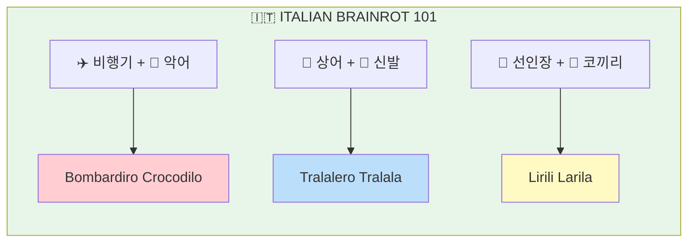
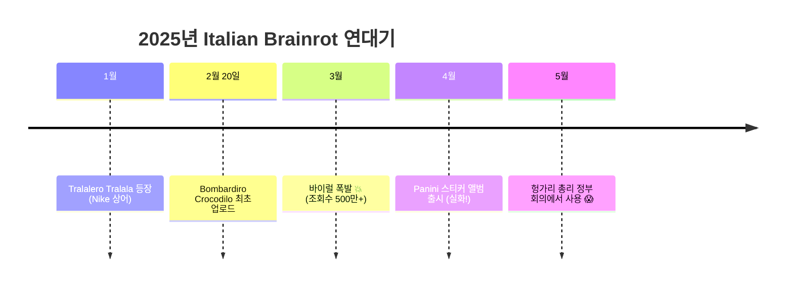
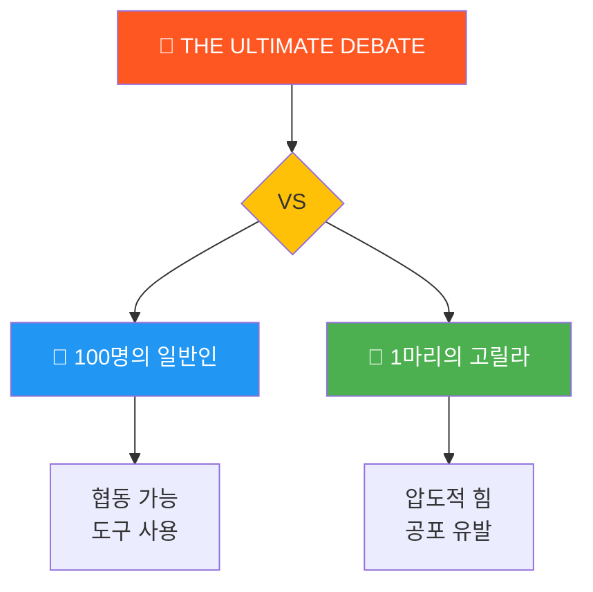

*2025년, 밈은 더 이상 사람만 만들지 않습니다*

## 2025년, 인터넷 밈의 역대급 해

2025년은 밈 역사에서 가장 기이하고, 창의적이고, 정신 나간(?) 해였습니다.

> "2025년 밈들은 어디서부터 설명해야 할지 모르겠다. 폭격기 악어? 지브리 벤 애플렉? 100명 vs 고릴라?"
> — 모든 인터넷 유저의 심정


*2025년 밈을 처음 본 사람들 반응*

---

## #1. Italian Brainrot: 폭격기 악어의 등장

### Bombardiro Crocodilo란?

2025년 초, TikTok을 뒤흔든 **Italian Brainrot** 밈!



> "이탈리아어 같은 이름 + AI 괴물 = 바이럴"

*출처: [Wikipedia - Italian Brainrot](https://en.wikipedia.org/wiki/Italian_brainrot)*

### 왜 이게 바이럴?

| 요소 | 설명 |
|------|------|
| **AI 생성 이미지** | 기괴한 합성 생물체 |
| **이탈리아어 TTS** | 웃긴 발음의 가짜 이탈리아어 |
| **완전한 넌센스** | 아무 의미 없음 = 재밌음 |
| **중독성** | 한 번 보면 계속 보게 됨 |

> "이 밈은 Gen Alpha 사이에서 인기입니다. 왜냐하면 바보같고, 웃기고, 중독적이기 때문입니다."
> — [Polskie Radio](https://knowyourmeme.com/memes/bombardiro-crocodilo-italian-brainrot)

### 타임라인



*출처: [Know Your Meme](https://knowyourmeme.com/memes/italian-brainrot-ai-italian-animals)*


*헝가리 정부 회의에서 Italian Brainrot 밈이 등장했다는 소식을 들었을 때*

---

## #2. Studio Ghibli AI 필터: 모든 걸 지브리로

### 지브리 AI 필터란?

2025년 3월, OpenAI가 GPT-4o 이미지 생성 기능을 출시하면서 터진 트렌드!

```
📸 아무 사진 + 🤖 ChatGPT = 🎨 지브리 스타일 변환
```

*출처: [CNN](https://www.cnn.com/2025/03/27/style/chatgpt-studio-ghibli-ai-images-intl-hnk/index.html)*

### 바이럴 변환 사례

| 원본 밈 | 지브리 버전 | 반응 |
|---------|------------|------|
| Distracted Boyfriend | 지브리화 됨 | "더 슬픔" |
| Bro Explaining | 지브리화 됨 | "더 진지함" |
| Ben Affleck 담배 | 지브리화 됨 | "예술이 됨" |


*모두가 자기 사진을 지브리화하는 중...*

### 논쟁: 미야자키 하야오 반응

> "AI가 생성한 예술은 생명 그 자체에 대한 모욕입니다. 완전히 혐오스럽습니다."
> — **미야자키 하야오**, 2016년 영상 (2025년 재조명)

*출처: [Know Your Meme](https://knowyourmeme.com/memes/studio-ghibli-ai-generator)*

```
인터넷 반응:

🧑: "지브리 AI 필터 최고!"
👴 미야자키: "생명에 대한 모욕"
🧑: "...그래도 쓸 거임"
```

### AI 이미지의 노란 색조 논쟁

2025년 5월, 사람들이 발견한 것:

> "왜 모든 AI 이미지가 노란색이야?"
> — 인터넷 전체

원인 추정: 지브리 스타일의 따뜻한 색감이 AI 모델에 과적합됨

*출처: [Know Your Meme - AI Art Becoming Yellow](https://knowyourmeme.com/memes/ai-art-becoming-yellow)*

---

## #3. 100명 vs 고릴라 논쟁

### 2025년 가장 뜨거웠던 논쟁



> "누가 이길까?" - 2025년 가장 뜨거웠던 논쟁

### 인터넷의 반응

```
팀 고릴라 🦍:
"고릴라 한 마리가 100명? ㅋㅋ 고릴라 압승"
"시뮬레이션 봤는데 고릴라가 다 때려잡음"
"인간은 너무 약함"

팀 100명 👥:
"100명이면 협동 가능"
"돌멩이랑 막대기 쓰면?"
"우리가 지구 정복한 이유가 있음"
```

### 시뮬레이션 결과

| 조건 | 승자 | 비고 |
|------|------|------|
| 맨손 | 🦍 고릴라 | 압도적 |
| 도구 허용 | 👥 100명 | 간신히 |
| 밀폐된 공간 | 🦍 고릴라 | 공포 그 자체 |
| 넓은 공간 | 👥 100명 | 도망치면서 공격 |


*실제로 테스트하면 안 됩니다*

### 왜 바이럴?

1. **답이 없음**: 어느 쪽도 확실한 승리 불가
2. **상상력 자극**: 모두가 시나리오를 상상함
3. **AI 시뮬레이션**: 다양한 결과 영상 생성
4. **논쟁 본능**: 인간은 논쟁을 좋아함

---

## #4. 기타 바이럴 밈들 2025

### Coldplay 키스캠 스캔들

```
상황:
- 2025년 7월 Coldplay 콘서트
- 키스캠에 어색한 커플 포착
- 크리스 마틴이 농담으로 언급
- 커플 신원 밝혀짐: 테크 CEO + 동료
- 전세계 바이럴
```

*출처: [Hollywood Reporter](https://www.hollywoodreporter.com/lists/best-worst-viral-social-media-moments-2025/)*

### "I Asked ChatGPT" 밈

```
유저: "ChatGPT한테 물어봤는데..."
인터넷: "그냥 Magic 8 Ball 써"

유저: "Grok한테도..."
인터넷: "동전이나 던져"

유저: "Claude한테..."
인터넷: "점쟁이 가라"
```

### ChatGPT Starter Pack 밈

2025년 4월, 새로운 밈 템플릿 등장:

> "내 채팅 기록 기반으로 스타터팩 이미지 만들어줘"

결과: 사람들의 민망한 AI 사용 내역이 밈으로 공개됨

```
보너스 프롬프트:
"너가 나에 대해 알고 있는 가장 당황스러운 건? 재밌게 만들어줘"
```

*출처: [AI Nauten](https://www.ainauten.net/p/chatgpt-viral-memes-google-cloud-next25-openai-interviews-canva-create-feature-updates)*

---

## 2025년 밈 트렌드 분석

### AI가 바꾼 밈 문화

```
2020년 밈: 사람이 만듦 → 사람이 공유
2025년 밈: AI가 만듦 → 사람이 공유 → AI가 또 만듦 → 무한 반복
```

### 밈 유형별 분석

| 유형 | 2024년 | 2025년 | 변화 |
|------|--------|--------|------|
| AI 생성 밈 | 10% | 60% | 6배 증가 |
| 텍스트 밈 | 40% | 15% | 감소 |
| 영상 밈 | 30% | 50% | 증가 |
| 논쟁형 밈 | 20% | 35% | 증가 |

### 2025 밈 트렌드 키워드

```
1️⃣ AI 생성 (Italian Brainrot, Ghibli Filter)
2️⃣ 넌센스 유머 (의미 없을수록 웃김)
3️⃣ 참여형 논쟁 (100 vs 1)
4️⃣ 셀프 폭로 (Starter Pack)
5️⃣ 스타일 변환 (모든 것을 지브리로)
```

---

## 2025 밈 어워드 (비공식)

### 카테고리별 수상

| 어워드 | 수상 밈 | 이유 |
|--------|---------|------|
| **Most Viral** | Bombardiro Crocodilo | 조회수 갑 |
| **Most Creative** | Studio Ghibli AI | 예술적 가치 |
| **Most Debated** | 100 vs 고릴라 | 끝나지 않는 논쟁 |
| **Most Controversial** | Coldplay 키스캠 | 실제 피해자 발생 |
| **Most Wholesome** | Ghibli 셀카 변환 | 다들 행복해함 |

---

## 마치며: 2025년 밈 문화의 의미


2025년 밈 문화에서 배운 것들:

### 핵심 인사이트

| # | 인사이트 |
|---|----------|
| 1 | AI가 밈 생산의 주력이 됨 |
| 2 | 넌센스가 새로운 유머 표준 |
| 3 | 참여형 콘텐츠가 확산력 높음 |
| 4 | 밈도 저작권 논쟁 대상 |

> "2025년 밈을 이해하려면, 이해하려 하지 말아야 한다"
> — 인터넷 현자

---

## 보너스: 2025 밈 용어 사전

```
📖 2025 밈 용어집

Brainrot: 뇌가 녹는다 = 너무 자극적인 콘텐츠
Italian Brainrot: 이탈리아어 + AI 괴물 밈
Ghibli Filter: 지브리 스타일 변환
Sigma: 독립적인 마인드셋 (여전히 유효)
Skibidi: 2024에서 이어진 넌센스 유머
100 vs 1: 인간 vs 동물 논쟁 밈
```

---

**2025년 가장 기억에 남는 밈은 무엇인가요?** 댓글로 공유해주세요!

---

## 참고 자료

- [Wikipedia - Italian Brainrot](https://en.wikipedia.org/wiki/Italian_brainrot)
- [Know Your Meme - Bombardiro Crocodilo](https://knowyourmeme.com/memes/bombardiro-crocodilo-italian-brainrot)
- [Know Your Meme - Studio Ghibli AI Generator](https://knowyourmeme.com/memes/studio-ghibli-ai-generator)
- [CNN - ChatGPT Studio Ghibli AI Images](https://www.cnn.com/2025/03/27/style/chatgpt-studio-ghibli-ai-images-intl-hnk/index.html)
- [Hollywood Reporter - Viral Social Media Moments 2025](https://www.hollywoodreporter.com/lists/best-worst-viral-social-media-moments-2025/)
- [Gulf News - 12 Viral Moments of 2025](https://gulfnews.com/entertainment/12-viral-and-trending-moments-of-2025-whats-your-top-pick-1.500365176)
- [Daily Dot - Bombardino Crocodilo Meme](https://www.dailydot.com/memes/bombardino-crocodilo-meme/)
