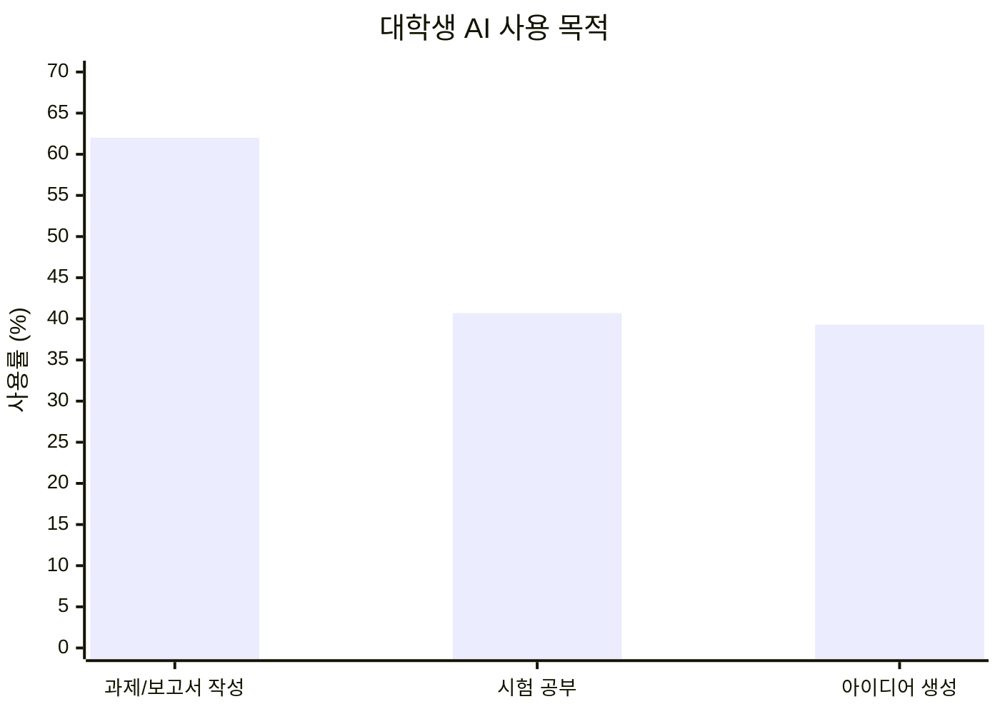

2025년 교육계는 **'전환(Transition)'과 '연결(Connection)'** 이라는 키워드로 요약됩니다. 대학생의 82.5%가 AI를 사용하고, 에듀테크 시장은 3,500억 달러로 성장이 예상되는 지금, 교육의 미래는 어떤 모습일까요?

## 목차

## 충격적인 AI 사용 현황

### 대학생 AI 사용률 변화

| 시기 | AI 사용률 | 출처 |
|------|----------|------|
| 2023년 봄 | 10% 미만 | 미들베리 대학 |
| 2024년 가을 | 82.5% | 미들베리 대학 |
| 2024년 12월 | 73.4% (주 1회 이상) | 상명대 설문조사 |

불과 2년 만에 **8배 이상** 증가한 놀라운 변화입니다.

### 대학생들이 AI를 사용하는 목적



## 2025년 7대 교육 트렌드

### 1. 인간 중심 기술(Human-Centric Skills) 부활 🧠

기계가 복제할 수 없는 역량이 교육과정에 다시 등장하고 있습니다:
- 비판적 사고
- 의사소통 능력
- 감성 지능
- 리더십과 팀워크

> "AI가 발전할수록 오히려 인간만의 고유한 능력이 더 가치있어집니다."

### 2. VR/AR 학습의 현실화 🥽

2025년, 가상현실(VR)과 증강현실(AR) 기술을 활용한 학습이 본격화됩니다:
- 의료 실습 시뮬레이션
- 역사적 사건 체험
- 과학 실험 가상 환경
- 언어 학습 몰입 환경

### 3. 에듀테크 시장 폭발 📈

| 연도 | 시장 규모 |
|------|----------|
| 2025년 | 약 1,420억 달러 |
| 2030년 | 약 3,500억 달러 |

**주목할 분야**:
- 온라인 학습 플랫폼
- AI 학습 도우미
- 몰입형 VR 학습 경험

### 4. AI 기반 개인화 학습 🎯

학습자마다 다른:
- 학습 속도
- 선호 콘텐츠 형식
- 약점 분야 집중 훈련
- 실시간 피드백

### 5. 원격 대학의 제도화 🏛️

서울디지털대학교 등 원격대학들이 **AI실무활용전공**을 신설하며 빠르게 변화하고 있습니다.

### 6. 평생학습 시대 📚

직장인 재교육, 경력 전환 학습이 보편화됩니다.

### 7. 마이크로 자격증 확산 🎓

대학 학위 대신 특정 기술을 증명하는 마이크로 자격증이 인기를 얻고 있습니다.

## 2026년 교육 정책 변화

### 주요 변화 예정

| 분야 | 변화 내용 |
|------|----------|
| AI 교육 | 수업 확대 |
| 에듀테크 도입 | 개인정보보호법 검토, 학운위 심사 필수 |
| 평가 방식 | 논술형 평가 확대 |

### AI 중점학교 확대

2026년부터 AI 중점학교와 디지털선도학교가 대폭 확대될 예정입니다.

## 교육자가 주목해야 할 AI 도구

### 학습 보조 도구

| 도구 | 용도 | 특징 |
|------|------|------|
| ChatGPT | 질문 답변, 글쓰기 | 범용성 |
| Claude | 학습 도우미 | 안전성, 정확성 |
| Notion AI | 노트 정리 | 생산성 |
| Gamma | 프레젠테이션 | 자동 디자인 |

### 교수자용 AI 도구

| 도구 | 용도 |
|------|------|
| 클래스팅 AI | 학습 관리 |
| Gradescope | 자동 채점 |
| Turnitin | 표절 검사 (AI 작성 감지) |

## 학생을 위한 AI 활용 가이드

### 올바른 AI 사용법

✅ **권장**:
- 아이디어 브레인스토밍
- 초안 작성 후 직접 수정
- 개념 이해를 위한 질문
- 문법/맞춤법 검토

❌ **주의**:
- 과제 전체를 AI에 의존
- 출처 확인 없이 사용
- 표절 가능성 무시

### 효과적인 프롬프트 작성법

```
[비효율적]
"인공지능에 대해 알려줘"

[효율적]
"대학교 2학년 수준에서 이해할 수 있게
인공지능의 머신러닝과 딥러닝의 차이를
구체적인 예시와 함께 설명해줘"
```

## 대학의 AI 대응 현황

### 긍정적 대응 사례

| 대학 | 대응 |
|------|------|
| 서울디지털대 | AI실무활용전공 신설 |
| 연세대 | AI 기초 필수 교양 |
| KAIST | AI 융합 전공 확대 |

### 정책적 고민

이길호 한국에듀테크산업협회장:
> "AI 기반 학습도구의 확산으로 교수학습 혁신이 예상보다 빠르게 진전됐지만, 이를 뒷받침해야 할 제도·평가·재정 체계 변화는 여전히 느리다"

## 미래 교육의 모습 예측

### 2030년 교육 시나리오

1. **AI 튜터**: 24시간 개인 맞춤 학습 지원
2. **VR 캠퍼스**: 물리적 공간 제약 해소
3. **역량 기반 평가**: 시험 대신 포트폴리오
4. **글로벌 협업**: 실시간 다국어 학습
5. **평생 학습 계정**: 전 생애 학습 이력 관리

### 사라질 것들

- 암기 위주 시험
- 일방적 강의
- 종이 교과서
- 획일화된 커리큘럼

## 결론: AI는 도구, 핵심은 인간

AI가 교육을 혁신하고 있지만, 교육의 본질은 변하지 않습니다:

> **비판적 사고, 창의성, 인간적 연결** — 이것이 AI 시대에도 교육이 추구해야 할 가치입니다.

2025년은 'AI 학습 원년'이 될 것입니다. 이 변화에 적응하는 학생, 교수자, 기관이 미래 교육을 이끌어 갈 것입니다.

---

*교육 트렌드에 대해 더 궁금한 점이 있으시면 댓글로 남겨주세요!*
