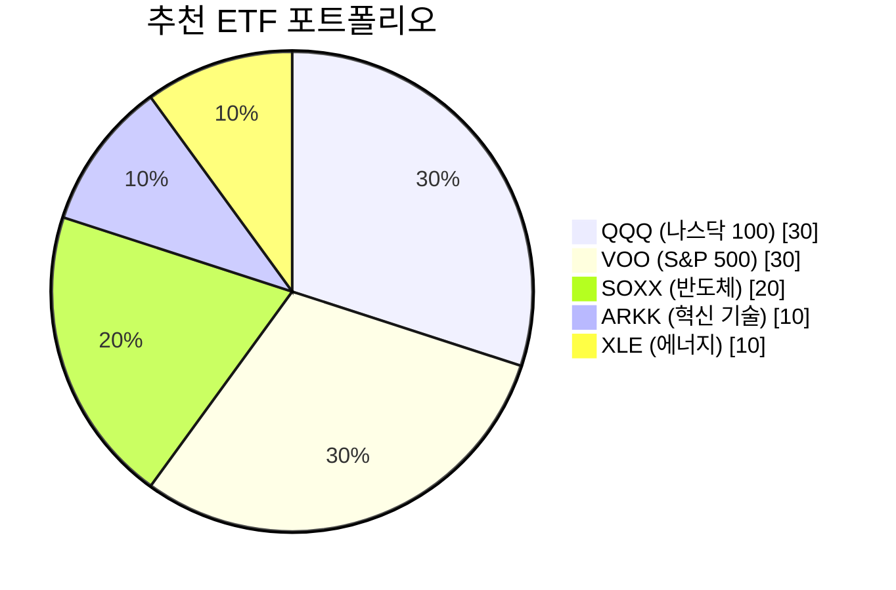

2025년 미국 주식 시장은 **AI 반도체 열풍**과 **테슬라 로보택시** 기대감으로 뜨겁게 달아오르고 있습니다. 이 글에서는 2025년 투자자들이 주목해야 할 핵심 트렌드와 전략을 분석합니다.

## 목차

## 2025년 미국 증시 현황

### 최근 시장 동향 (2025년 12월)

2025년 12월 22일 기준:
- **S&P 500**: +0.8% 상승
- **나스닥**: +0.6% 상승
- **다우 지수**: +300포인트

특히 Nvidia가 중국에 H200 AI 칩 출하 계획을 발표한 후 기술주가 강세를 보이고 있습니다.

### 경제 기조

| 지표 | 상황 |
|------|------|
| 연준 금리 정책 | 6월 첫 25bp 인하 후 완화 기조 유지 |
| 물가 | 안정화 신호 감지 |
| 고용 | 개선 추세 |
| 소비 지출 | 기대치 상회 |

## 주목해야 할 5대 섹터

### 1. AI 반도체 🔥

**핵심 포인트**: 2020년대 초반 Apple, Microsoft 중심의 전통 기술주 시대에서 **완전한 AI 반도체 중심의 시대**로 전환

| 기업 | 투자 포인트 |
|------|------------|
| NVIDIA | ChatGPT 이후 AI 학습 수요 직접 수혜 |
| AMD | 데이터센터 GPU 경쟁력 |
| TSMC | 첨단 반도체 파운드리 독점적 위치 |

### 2. 테슬라(TSLA) - 로보택시의 꿈

#### 2025년 12월 주가 전망

| 시나리오 | 목표가 | 조건 |
|---------|--------|------|
| 최소 | $409 | 현상 유지 |
| 평균 | $453 | 기본 예측 |
| 최대 | $501 | FSD 상용화 성공 |

#### FSD 완전자율주행 현황

일론 머스크 CEO의 발표:
- 텍사스 오스틴에서 **3주 내 감독형 FSD에서 안전 운전자 제거**
- **2025년 말 완전 무인 로보택시 운영** 목표
- 비감독형 FSD 유료 서비스 출시 계획

#### 애널리스트 의견

| 기관 | 평가 | 목표가 |
|------|------|--------|
| Deutsche Bank | 2026년 최우선 추천 | $470 |
| Morgan Stanley | Hold | - |
| WSJ 최고 전망 | Buy | $528 |

### 3. 에너지 섹터

미국-베네수엘라 긴장으로 유가가 상승하면서 에너지 주식이 시장을 주도하고 있습니다.

### 4. 디지털 헬스케어

AI 기반 진단, 원격의료, 바이오테크가 장기 성장 동력으로 주목받고 있습니다.

### 5. AI 인프라

데이터센터, 클라우드 서비스, AI 소프트웨어 기업들이 지속적인 성장세를 보이고 있습니다.

## 추천 ETF 포트폴리오

### 핵심 ETF 구성



### ETF 장단점

**장점**:
- 개별 종목 리스크 분산
- 시장 전반 노출
- 낮은 운용 비용

**단점**:
- 개별 종목 대비 낮은 상승 잠재력
- 시장 하락 시 함께 하락

## 2025년 투자 리스크 요인

### 주의해야 할 변수

1. **무역정책 변화**: 트럼프 2기 행정부의 관세 정책
2. **인플레이션 지속**: 예상보다 높은 물가 상승 가능성
3. **초대형주 집중도**: 소수 종목에 수익률 편중
4. **밸류에이션 우려**: 테슬라 P/E 114.94 등 고평가 논란

### 대응 전략

| 리스크 | 대응 |
|--------|------|
| 변동성 | 분할 매수, 적립식 투자 |
| 섹터 집중 | 다양한 산업 분산 |
| 개별주 리스크 | ETF 활용 |

## 2025년 월별 투자 캘린더

| 월 | 이벤트 | 주목 포인트 |
|----|--------|------------|
| 1월 | CES 2025 | AI, 전기차 신제품 |
| 2월 | 테슬라 실적 | 4Q 배송량 |
| 3월 | Fed 회의 | 금리 결정 |
| 4월 | 1Q 실적 시즌 | 기업 가이던스 |
| 6월 | WWDC, 반도체 행사 | 신기술 발표 |
| 12월 | 연말 랠리 | 세금 관련 매매 |

## 초보 투자자를 위한 3단계 전략

### 1단계: 기초 다지기
```
- 미국 증권 계좌 개설 (키움, 토스, 미래에셋 등)
- 환전 최적화 (환율 스프레드 비교)
- 소액으로 시작 (월 10-30만원)
```

### 2단계: 포트폴리오 구축
```
- 핵심 ETF (VOO, QQQ) 60%
- 성장 ETF (SOXX, ARKK) 30%
- 개별 종목 10%
```

### 3단계: 지속적 관리
```
- 분기별 리밸런싱
- 뉴스 및 실적 모니터링
- 장기 투자 마인드 유지
```

## 결론: 2025년은 분산투자의 해

2025년 미국 주식 시장의 핵심 키워드는 **"회복탄력성"**입니다. 불확실성 속에서도 시장은 4월 저점에서 극적으로 반등하며 연말 사상 최고치 부근에서 거래되고 있습니다.

**투자 체크리스트**:
- ✅ AI 반도체, 테슬라 FSD 등 실적 성장 섹터 주목
- ✅ ETF를 통한 리스크 분산
- ✅ 장기 투자 관점 유지
- ✅ 분할 매수로 변동성 대응

> "AI 인프라, 반도체, 디지털 헬스케어 — 이 흐름을 미리 이해하고 준비하는 것이 2025년 이후의 현명한 포지션입니다."

---

*투자에는 원금 손실의 위험이 있습니다. 본 글은 정보 제공 목적이며 투자 조언이 아닙니다. 투자 결정은 본인의 판단과 책임 하에 이루어져야 합니다.*
