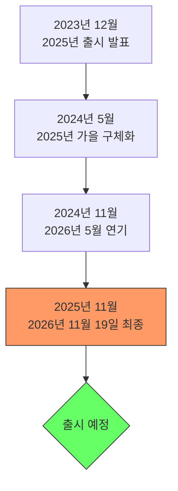

역대 두 번째로 많이 팔린 게임 시리즈의 최신작, **GTA 6**가 드디어 모습을 드러냈습니다. 출시일 연기 논란부터 두 번째 트레일러 추측까지, 알아야 할 모든 것을 정리했습니다.


*출처: [GameSpot - Rockstar Games 공식 스크린샷](https://www.gamespot.com/gallery/gta-6-screenshots-images/2900-6525/)*

## 목차

## 출시일 확정: 2026년 11월

### 출시일 변경 히스토리

| 시기 | 발표 내용 |
|------|----------|
| 2023년 12월 | 2025년 내 출시 발표 |
| 2024년 5월 | 2025년 가을로 구체화 |
| 2024년 11월 | **2026년 11월 19일로 연기** |

> 테이크투 인터랙티브의 2026년 2분기 실적 발표를 통해 공식 확인되었습니다.

### 왜 연기되었나?



락스타 게임즈는 공식적인 이유를 밝히지 않았지만, 업계에서는:
- 차세대 콘솔 최적화
- 방대한 오픈월드 완성도
- GTA 온라인 통합 서비스

등을 이유로 추정하고 있습니다.


*"2025년 출시된다더니..."*

## 첫 번째 트레일러 분석

### 공개 정보

| 항목 | 내용 |
|------|------|
| 공개일 | 2023년 12월 5일 (한국 시각) |
| 채널 | 락스타 게임즈 공식 유튜브 |
| 조회수 | 2억 회 이상 |

### 트레일러 주요 내용

1. **바이스 시티 귀환**: 마이애미를 모티브로 한 도시
2. **루시아**: 시리즈 최초 여성 주인공
3. **현대적 배경**: 소셜 미디어, 인플루언서 문화 반영
4. **듀얼 주인공**: 보니와 클라이드 스타일의 커플

### 트레일러 속 힌트

```
0:27 - 차량에 "27" 숫자 선명히 표시
      → 12월 27일 두 번째 트레일러 공개 추측의 근거
```

## 두 번째 트레일러 예상

### 팬들의 추측 근거

| 단서 | 해석 |
|------|------|
| 차량의 27 숫자 | 12월 27일 암시? |
| 인스타그램 게시물 27개 | 의도적 배치? |
| 첫 트레일러 1주년 | 12월 기념 발표? |

### 락스타의 공식 입장

> 락스타게임즈는 두 번째 트레일러 공개 날짜에 대해 **공식적인 발표를 하지 않은 상태**입니다.

## 게임 상세 정보

### 주인공: 루시아


*출처: [GameSpot - Rockstar Games 공식 캐릭터 이미지](https://www.gamespot.com/gallery/gta-6-screenshots-images/2900-6525/)*

| 항목 | 내용 |
|------|------|
| 성별 | 여성 (시리즈 최초 플레이어블) |
| 배경 | 전과자, 범죄 조직 연루 |
| 파트너 | 남성 파트너와 듀오 |
| 스타일 | 보니와 클라이드 오마주 |

### 배경: 바이스 시티

| 특징 | 설명 |
|------|------|
| 모티브 | 마이애미, 플로리다 |
| 시대 | 현대 (2020년대) |
| 분위기 | 네온, 해변, 라틴 문화 |
| 확장 | 역대 최대 맵 규모 예상 |

### 예상 시스템

```markdown
- 현대적 범죄 시뮬레이션
- 소셜 미디어 시스템
- 발전된 NPC AI
- 리얼리즘 물리 엔진
- GTA 온라인 2.0 통합
```

## 플랫폼 및 사양

### 출시 플랫폼 (예상)

| 플랫폼 | 출시 시기 |
|--------|----------|
| PS5 | 2026년 11월 (동시 출시) |
| Xbox Series X/S | 2026년 11월 (동시 출시) |
| PC | 2027년 (1년 후 예상) |

### PC 사양 (추정)

| 사양 | 최소 | 권장 |
|------|------|------|
| CPU | Ryzen 5 3600 | Ryzen 7 5800X |
| GPU | RTX 3060 | RTX 4070 |
| RAM | 16GB | 32GB |
| 저장공간 | 150GB+ | 200GB+ SSD |

> ⚠️ 공식 사양은 아직 발표되지 않았습니다.

## GTA 5와의 비교

### 개발 기간

| 게임 | 발표 → 출시 |
|------|------------|
| GTA 5 | 2011 → 2013 (2년) |
| GTA 6 | 2023 → 2026 (3년) |

### 예상 차이점

| 항목 | GTA 5 | GTA 6 (예상) |
|------|-------|-------------|
| 맵 크기 | 로스 산토스 | 2배 이상 |
| 주인공 | 3명 (모두 남성) | 2명 (남녀) |
| 온라인 | 별도 모드 | 통합 |
| 그래픽 | 2013년 수준 | 차세대 |

## 기대와 우려

### 기대 포인트

✅ 12년 만의 신작
✅ 차세대 그래픽
✅ 시리즈 최초 여성 주인공
✅ 바이스 시티 현대화
✅ 발전된 온라인 모드

### 우려 포인트

⚠️ 높은 가격 예상 ($70+)
⚠️ PC 후발 출시
⚠️ 과도한 마이크로트랜잭션 가능성
⚠️ 온라인 의무화 우려

## 투자자 관점

### 테이크투 인터랙티브 (TTWO)

GTA 6 출시는 게임 업계 최대 이벤트 중 하나입니다:

| 지표 | GTA 5 실적 | GTA 6 기대 |
|------|-----------|-----------|
| 첫 주 판매 | 1,150만 장 | 2,000만 장+ |
| 총 판매 | 1.95억 장 | 2억 장+ |
| 수익 | $80억+ | $100억+ |

## 결론: 기다림의 끝이 보인다

GTA 6는 단순한 게임이 아닌 **문화 현상**이 될 것입니다:

- 📅 **2026년 11월 19일** 출시 확정
- 👩 시리즈 최초 **여성 주인공** 루시아
- 🌴 **바이스 시티** 현대화 버전
- 🎮 **PS5, Xbox Series X/S** 동시 출시

12년의 기다림, 이제 1년 남았습니다!


*"GTA 5가 나올 때 대학생이었는데, GTA 6 나올 때는 직장인이네..."*

---

*GTA 6에 대해 더 알고 싶은 점이 있다면 댓글로 남겨주세요!*
