*2025년, AI는 단순 챗봇에서 자율 에이전트로 진화했습니다*

## 들어가며: 400억 달러 규모의 AI 에이전트 전쟁 🔥

2025년 12월, AI 업계는 역사적인 전환점을 맞이했습니다. **Google, OpenAI, Anthropic**이 같은 달에 차세대 AI 모델을 동시에 출시하며, 기술 역사상 가장 치열한 경쟁이 펼쳐지고 있습니다.

> "2025년은 AI가 개발자를 대체할 해라고 했지만, 전혀 그렇지 않았다."
> — **Zach Lloyd**, Warp CEO ([TechCrunch](https://techcrunch.com/2025/12/11/google-launched-its-deepest-ai-research-agent-yet-on-the-same-day-openai-dropped-gpt-5-2/))


*AI: "개발자 대체할게요" / 현실: "다시 실행해주세요, 에러났어요" 😅*

---

## 🎭 AI 밈으로 보는 2025 트렌드

2025년 Reddit과 Twitter에서 가장 핫한 AI 밈들! ([출처: Know Your Meme](https://knowyourmeme.com/memes/sites/chatgpt))

### "I Asked ChatGPT, I Asked Grok" 밈

```
👤: "ChatGPT한테 물어봤는데..."
🌐: "그냥 Magic 8 Ball 흔들어봐"
👤: "Grok한테도..."
🌐: "제발 그냥 동전 던져"
```

이 밈이 바이럴된 이유? AI에게 모든 걸 물어보는 우리 자신을 셀프 디스하는 거죠 🤣

### Claude의 "가짜 진행 중" 밈


> **Claude**: *"Processing... Analyzing... Thinking..."*
> **실제로 하는 일**: 아무것도 안 함
> **개발자**: "이거 완전 나잖아"
> — [ProgrammerHumor.io](https://programmerhumor.io/memes/claude)

---

## 2025년 12월 주요 AI 모델 출시 일정

| 모델 | 출시일 | 개발사 | 주요 특징 | 밈 포인트 |
|------|--------|--------|----------|-----------|
| **Gemini 3 Pro** | 2025.12.11 | Google | Deep Research 에이전트 | "검색 결과 0건" 졸업 🎓 |
| **GPT-5.2** | 2025.12.11 | OpenAI | 멀티모달 강화 | 대시(—) 중독 여전함 — 이렇게 |
| **Claude Opus 4.5** | 2025.11.24 | Anthropic | 코딩 최강, 5.5시간 자율 작업 | "Sorry, I can't..." 덜 말함 |
| **Grok 4.1** | 2025.12 | xAI | 대화 특화, 실시간 정보 | 일론 팬보이 모드 탑재 |

*출처: [Vertu Lifestyle](https://vertu.com/lifestyle/the-ai-model-race-reaches-singularity-speed/)*

---

## 모델별 심층 분석 (+ 솔직한 리뷰)

### 1. Google Gemini 3 Pro + Deep Research 🔬


*Gemini Deep Research: 수시간 자율 연구가 가능한 에이전트*

Google이 발표한 **Gemini Deep Research**는 AI 연구 에이전트의 새로운 기준을 제시했습니다.

#### 핵심 특징:
- **수시간 자율 연구**: 인간 개입 없이 복잡한 연구 프로젝트 수행
- **최고 정확도**: "가장 사실에 기반한(most factual)" 모델
- **환각 최소화**: 장시간 추론 작업에서 할루시네이션 감소

#### 솔직한 평가:

| 장점 ✅ | 단점 ❌ |
|---------|---------|
| 팩트체크 최강 | 창의성은 좀... |
| 긴 문서 분석 굿 | 가끔 너무 보수적 |
| 무료 티어 관대함 | 한국어 응답 어색할 때 |

> "Deep Research는 단순한 질의-응답을 넘어, 정보가 합성되는 방식의 근본적인 변화를 나타냅니다."
> — [Financial Content](https://markets.financialcontent.com/wral/article/tokenring-2025-12-25-the-dawn-of-the-autonomous-investigator-google-unveils-gemini-deep-research-and-gemini-3-pro)

---

### 2. Anthropic Claude Opus 4.5 🏆


*Claude가 5.5시간 동안 코딩하는 모습 (실제)*

Claude Opus 4.5는 **코딩과 에이전트 작업**에서 독보적인 성능을 자랑합니다.

#### 벤치마크 성능:
```
┌─────────────────────────────────────────┐
│ 🥇 SWE-bench Verified: 80.9% (1위)     │
│ 💻 OSWorld (컴퓨터 사용): 66.3%        │
│ ⏱️  자율 작업 시간: 5.5시간 연속        │
│ 🔧 도구 사용 횟수: 3,000+ 회           │
└─────────────────────────────────────────┘
```

#### 💸 가격 (2025년 12월):
| 타입 | 가격 (100만 토큰당) | 커피로 환산 ☕ |
|------|---------------------|---------------|
| 입력 | $5 | 아메리카노 1잔 |
| 출력 | $25 | 라떼 5잔 |

*출처: [Fello AI](https://felloai.com/the-best-ai-of-december-2025/)*

#### 실제 사례: Claude.ai 자율 재구축

```mermaid
graph LR
    A[😎 시작] --> B[🔍 코드 분석]
    B --> C[📝 리팩토링 계획]
    C --> D[⚡ 구현]
    D --> E[✅ 테스트]
    E --> F[🎉 5.5시간 후 완료]
```



Claude 4.5 Sonnet은 **Claude.ai 웹 애플리케이션 전체**를 5.5시간 동안 3,000회 이상의 도구 사용으로 자율 재구축했습니다.

**Reddit 반응:**
> "Claude가 Claude를 고쳤다고? 이게 바로 재귀함수 아님?" 🔄
> — r/ProgrammerHumor

---

### 3. OpenAI GPT-5.2 🌟


*GPT-5.2: 전문가 수준의 멀티태스크 AI*

GPT-5.2는 **전문 지식 작업**에서 인간 전문가 수준에 근접한 성능을 보여줍니다.

#### 주요 개선점:
- ⚡ **빠른 응답 속도** - "finally, 로딩 바 그만 봐도 됨"
- 🧠 **강화된 문맥 이해** - 10턴 전 대화도 기억
- 👁️ **향상된 시각 해석** - 손글씨 인식 레벨업
- 🤖 **에이전틱 워크플로우 최적화** - 자동화 진짜 됨

#### GPT의 대시(—) 중독 밈 🤣

```
유저: "대시 좀 그만 써줘"
GPT: "알겠습니다 — 앞으로는 — 대시를 — 사용하지 — 않겠습니다"
유저: "..."
```

*출처: [CanIPhish AI Memes](https://caniphish.com/blog/ai-memes)*

> "GPT-5.2는 연구, 코딩, 창작 등 복잡한 전문 작업에서 인간 전문가 수준의 성능에 가까워지고 있습니다."
> — [The420.in](https://the420.in/ai-2025-gemini-3-gpt-5-agentic-browsers-sora/)

---

## 🎮 AI 모델 선택 미니게임

어떤 AI가 당신에게 맞을까요?

```
🎯 LEVEL 1: 무슨 작업?
  │
  ├─ 🔧 코딩/디버깅 ─────────────► Claude Opus 4.5
  │   "버그 잡는 건 내가 최고"
  │
  ├─ 📚 심층 연구/논문 ──────────► Gemini Deep Research
  │   "팩트는 나한테 맡겨"
  │
  ├─ 🎨 창작/글쓰기 ─────────────► GPT-5.2
  │   "상상력은 나지— (대시는 덤)"
  │
  └─ 😂 그냥 대화/밈 ────────────► Grok 4.1
      "농담은 내가 제일 잘함 ㅋㅋ"
```

---

## AI 에이전트 아키텍처 이해하기

### 기본 워크플로우

```
┌──────────────────────────────────────────────────────────┐
│           🤖 AI 에이전트 워크플로우 (찐 ver.)             │
├──────────────────────────────────────────────────────────┤
│                                                          │
│   ┌─────────┐    ┌─────────┐    ┌─────────┐    ┌───────┐ │
│   │👀 인식  │ -> │🧠 결정  │ -> │⚡ 행동  │ -> │📝 학습│ │
│   │ Perceive│    │ Decide  │    │  Act    │    │ Learn │ │
│   └─────────┘    └─────────┘    └─────────┘    └───────┘ │
│                                                          │
│   "봤다 -> 생각했다 -> 했다 -> 배웠다" 무한 루프 🔄       │
│                                                          │
└──────────────────────────────────────────────────────────┘
```

*참고: [Lindy.ai AI Agent Architecture Guide](https://www.lindy.ai/blog/ai-agent-architecture)*

### 세 가지 핵심 아키텍처 유형

| 아키텍처 | 특징 | 비유 | 적합한 작업 |
|----------|------|------|------------|
| **Reactive** | 즉각 반응, 메모리 없음 | 반사신경 🦎 | 실시간 응답 |
| **Deliberative** | 계획 수립, 장기 메모리 | 체스 마스터 ♟️ | 복잡한 프로젝트 |
| **Hybrid** | 반응 + 계획 결합 | 만능 스포츠맨 🏃 | 대부분의 실제 작업 |

*출처: [Medium - Binome](https://medium.com/binome/ai-agent-workflow-design-patterns-an-overview-cf9e1f609696)*

---

## 2025년 핵심 트렌드: MCP (Model Context Protocol) 🔌

2025년 가장 주목받은 기술 중 하나는 **MCP(Model Context Protocol)**입니다.

> "MCP 서버를 운영하는 것이 웹 서버를 운영하는 것만큼 일반화되었습니다."
> — [The New Stack](https://thenewstack.io/ai-engineering-trends-in-2025-agents-mcp-and-vibe-coding/)

### MCP란? (쉬운 설명)


**MCP = AI의 USB 포트** 🔌

AI가 외부 도구에 연결할 수 있는 표준 규격입니다.

```yaml
# MCP 서버 설정 예시 (진짜 이게 끝!)
mcpServers:
  github:
    command: npx
    args: ["-y", "@anthropic/mcp-server-github"]
  telegram:
    command: uv
    args: ["run", "telegram-mcp"]
```

#### MCP로 할 수 있는 것들:
| 기능 | 설명 | 실용 예시 |
|------|------|----------|
| 📁 파일 시스템 | 로컬 파일 읽기/쓰기 | "바탕화면에 저장해줘" |
| 🌐 웹 브라우저 | 페이지 탐색, 클릭 | "티켓팅 해줘" (응?) |
| 💾 데이터베이스 | SQL 쿼리 실행 | "매출 데이터 뽑아줘" |
| 📧 메시지 전송 | 슬랙, 텔레그램 | "팀에 알려줘" |
| 🔧 개발 도구 | Git, Docker | "커밋하고 배포해" |

---

## 💰 가격 비교 (2025년 12월) - 지갑 걱정 필수

| 모델 | 입력 (1M 토큰) | 출력 (1M 토큰) | 월 예산 🗓️ | 한 줄 평 |
|------|----------------|----------------|-----------|---------|
| GPT-5.2 | $10 | $30 | 💸💸💸 | 비싸도 잘함 |
| Claude Opus 4.5 | $5 | $25 | 💸💸 | 코딩엔 가성비 갑 |
| Gemini 3 Pro | $3.50 | $10.50 | 💸 | 무료도 훌륭 |
| Claude Sonnet 4 | $3 | $15 | 💸 | 만능 밸런스 |

*출처: [IntuitionLabs AI Pricing](https://intuitionlabs.ai/articles/ai-api-pricing-comparison-grok-gemini-openai-claude)*

### 실제 사용 시나리오 💡

```
📝 블로그 글 1개 쓰기 (약 2000자)
├─ GPT-5.2: ~$0.05
├─ Claude Opus: ~$0.03
└─ Gemini 3: ~$0.01 (거의 무료!)

💻 코드 프로젝트 한 달 (헤비 유저)
├─ GPT-5.2: ~$50
├─ Claude Opus: ~$30
└─ Gemini 3: ~$15
```

---

## 🏆 최종 추천 정리

### 용도별 원픽

```
🔧 코딩/개발      → Claude Opus 4.5 (SWE-bench 1위는 다 이유가 있음)
📊 데이터 분석    → Gemini 3 Pro (무료로도 충분)
✍️ 콘텐츠 작성    → GPT-5.2 (창의력 갑 — 대시도 갑)
💬 잡담/밈        → Grok 4.1 (개그 센스 탑재)
🔬 심층 연구      → Gemini Deep Research (논문 쓸 때 필수)
```

### 예산별 추천

| 예산 | 추천 조합 | 이유 |
|------|----------|------|
| 무료 | Gemini 3 Pro | 무료 티어 혜자 |
| $20/월 | Claude Sonnet 4 + Gemini | 밸런스 조합 |
| $100/월 | Claude Opus + GPT-5.2 | 양대산맥 풀셋 |
| 무제한 💰 | 전부 다 | "돈이 문제가 아냐" |

---

## 마치며: 에이전틱 AI의 시대 🚀


2025년은 **"Agentic"이 올해의 단어**가 된 해입니다. AI는 더 이상 질문에 답하는 도구가 아니라, 스스로 계획하고 실행하는 **자율 에이전트**로 진화하고 있습니다.

### 핵심 포인트 요약 📌

| # | 포인트 | 상세 |
|---|--------|------|
| 1️⃣ | **투자 폭발** | 400억 달러 이상 AI 인프라에 투자 |
| 2️⃣ | **코딩 AI 진화** | 자동완성 → 완전한 에이전틱 코딩 |
| 3️⃣ | **MCP 표준화** | AI 도구 연결의 USB 탄생 |
| 4️⃣ | **전문화 경쟁** | 코딩=Claude, 대화=Grok, 연구=Gemini |

> "하나의 모델이 모든 작업을 지배하기보다, 전략적 포지셔닝이 이루어지고 있습니다 — 코딩은 Claude, 대화는 Grok, 멀티모달은 Gemini, 전문 지식은 GPT."
> — [Passionfruit](https://www.getpassionfruit.com/blog/gpt-5-1-vs-claude-4-5-sonnet-vs-gemini-3-pro-vs-deepseek-v3-2-the-definitive-2025-ai-model-comparison)

---

## 🎁 보너스: 2025 AI 밈 베스트 모음

끝까지 읽어주셔서 감사합니다! 보너스로 2025년 최고의 AI 밈들 모아봤어요:

1. **Claude의 "Sorry, I can't..."** - 이제는 좀 나아짐
2. **GPT의 em-dash(—) 중독** - 여전히 건재
3. **Gemini의 "Let me search that"** - 드디어 진짜 검색함
4. **Grok의 "As an AI made by Elon..."** - 매번 언급

*밈 출처: [CanIPhish AI Memes](https://caniphish.com/blog/ai-memes), [Supermeme.ai](https://supermeme.ai/blog/chatgpt-memes)*

---

**여러분은 어떤 AI 에이전트를 사용하고 계신가요?** 댓글로 경험을 공유해주세요! 👇

---

## 📚 참고 자료

- [TechCrunch - Google Deep Research and GPT-5.2](https://techcrunch.com/2025/12/11/google-launched-its-deepest-ai-research-agent-yet-on-the-same-day-openai-dropped-gpt-5-2/)
- [The New Stack - AI Engineering Trends 2025](https://thenewstack.io/ai-engineering-trends-in-2025-agents-mcp-and-vibe-coding/)
- [Anthropic - Building Effective Agents](https://www.anthropic.com/research/building-effective-agents)
- [Microsoft Azure - AI Agent Design Patterns](https://learn.microsoft.com/en-us/azure/architecture/ai-ml/guide/ai-agent-design-patterns)
- [Medium - The $40B AI Shift](https://medium.com/activated-thinker/ai-shift-40-billion-agents-gpt5-gemini3-e18fa56066fb)
- [Know Your Meme - ChatGPT](https://knowyourmeme.com/memes/sites/chatgpt)
- [CanIPhish - Top 11 AI Memes 2025](https://caniphish.com/blog/ai-memes)
- [ProgrammerHumor.io - Claude Memes](https://programmerhumor.io/memes/claude)
